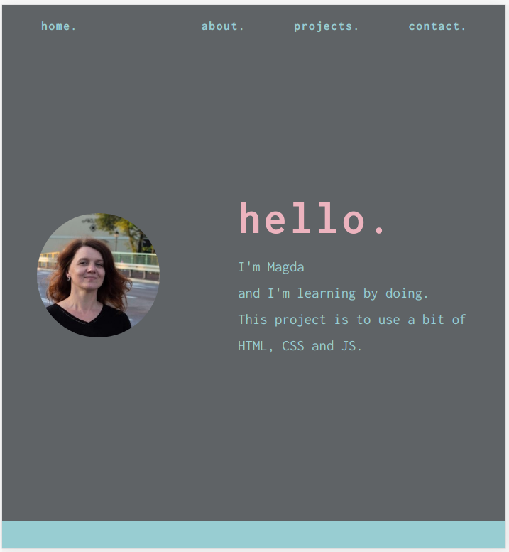

# 100 Days Of Code - Log Round 4

### Day 86: July 29, 2019

**Plans for Today:**
1. Write blog summary of the last week
2. JavaScript (1h)
3. Python (1h)
4. Work with DRF - adding Facebook registration and login

**Today's Progress:**
1. Blog post - done
2. An hour of JavaScript - video and 3 or 4 tasks on freeCodeCamp
3. Python - an hour
4. Messing up with DRF. Tried to refactor code in such a way not to have username in endpoints, but failed. Definitely I don't know how to write tests to check registration , password reset and so on in DRF.

**Thoughts:**
I feel a bit smitten by Django REST. I can't understand how all things are joined, I can't see the bigger picture. And the tests are like a witchcraft.

**Link to work:**
* http://makneta.herokuapp.com/post/week-6-of-my-summer-of-code/

**Plans for tomorrow:**
1. Start writing about using Docker in my app
2. Check why the registration endpoint doesn't want passwords while login endpoint still wants username. Try to write tests for this.
3. 1h of JavaScript
4. 1h of Python 

**Resources:**
* Learn Python 3 the Hard Way (polish version)
* Learn JavaScript (Youtube: https://www.youtube.com/watch?v=PkZNo7MFNFg&t=3s )
* freeCodeCamp Basic JavaScript

**Useful links**:
* https://www.agiliq.com/blog/2018/05/django-unit-testing/
* https://django-rest-auth.readthedocs.io/en/latest/faq.html?fbclid=IwAR11jC-wZuEj4io8uL6HFI5D1q-UbDs6jidqt5nWr5dI5d0Rrcpz825MGLg
* https://testdriven.io/courses/real-time-app-with-django-channels-and-angular/part-one-authentication/
* https://www.reddit.com/r/django/comments/46d0ju/djangorestframework_how_to_write_tests_to_check/
* https://www.django-rest-framework.org/api-guide/testing/
* https://hakibenita.com/django-rest-framework-slow
* https://pytest-django-testing.readthedocs.io/pl/latest/index.html
* https://aalvarez.me/posts/testing-django-and-drf-with-pytest/
* https://semaphoreci.com/community/tutorials/writing-testing-and-deploying-a-django-api-to-heroku-with-semaphore


### Day 85: July 28, 2019

**Plans for Today:**
1. Write & publish tech post about links and adding the next html files.
2. Resolve problem in DRF project, add registration through social media.
3. Django books app - check carefully why login/logout doesn't work
4. JavaScript (1h)
5. Python (1h)

**Today's Progress:**
1. Wrote & published the post
2. Fixed my problem with username. Started adding registration through facebook. Registrated on fb for developers.
3. One hour of JavaScript - done


**Thoughts:**

**Link to work:**
http://makneta.herokuapp.com/post/active-links-in-django-and-detail-post-template/

**Plans for tomorrow:**
1. Write blog summary of the last week
2. JavaScript (1h)
3. Python (1h)
4. Work with DRF - adding Facebook registration and login

**Resources:**
1. Learn JavaScript - youtube: https://www.youtube.com/watch?v=PkZNo7MFNFg&t=3s
2. Django for Beginners
3. Learn Python 3 the Hard Way (ebook in my native language: Python 3 Proste wprowadzenie do fascynującego świata programowania)
4. Django Rest Auth documentation: https://django-rest-auth.readthedocs.io/en/latest/index.html
5. Django allauth docs: https://django-allauth.readthedocs.io/en/latest/

**Useful links:**
* https://medium.com/@gajeshbhat/django-allauth-setup-and-configuration-tutorial-63417bba339c
* https://medium.com/@gajeshbhat/extending-and-customizing-django-allauth-eed206623a1a
* https://medium.com/@gajeshbhat/django-allauth-social-login-tutorial-ad021c24d666

### Day 84: July 27, 2019

**Plans for Today:**
1. Start new tech post -1h
2. Python -1h
3. Django books app - check carefully why login/logout doesn't work
4. Resolve problem in DRF project, add registration through social media.
5. JavaScript -1h

**Today's Progress:**
1. Started Learn JavaScript on Youtube
2. Wrote a short tech post - first draft
3. Python - 1h

**Thoughts:**
I can't postpone learning JavaScript any longer. I found a great position for a Django junior developer, but in the application form there were more JavaScript questions than Django :-( . So an easy conclusion is that I won't find a job in web development without JavaScript. I have known about it for a longer while. Now time to finish this childish behavior "I don't like JavaScript. JavaScript is weird. I don't want to learn it." No more.
So far the youtube course (that is based on freeCodeCamp curriculum) is a repetition for me. But I hope to learn new things pretty soon.

**Link to work:**

**Plans for tomorrow:**
1. One hour of writing tech post
2. One hour of Python
3. Django books app - add signup form, login/logout, change/reset the password. Try to use tests first when it is possible and needed.
4. Resolve problem in DRF project, add registration through social media.
5. Learn JavaScritp on youtube continue

**Resources:**
* https://stackoverflow.com/questions/36698456/django-rest-auth-email-instead-of-username
* https://github.com/Tivix/django-rest-auth/issues/53
* https://medium.com/@katherinekimetto/simple-facebook-social-login-using-django-rest-framework-e2ac10266be1
* https://stackoverflow.com/questions/36910373/django-rest-auth-allauth-registration-with-email-first-and-last-name-and-witho/44689509
* https://stackoverflow.com/questions/28954508/django-rest-framework-and-python-social-auth-for-registration-login-user
* https://stackoverflow.com/questions/17861846/plug-in-django-allauth-as-endpoint-in-django-rest-framework?rq=1
* https://django-rest-auth.readthedocs.io/en/latest/api_endpoints.html
* https://simpleisbetterthancomplex.com/tutorial/2016/10/24/how-to-add-social-login-to-django.html
* https://github.com/st4lk/django-rest-social-auth
* https://www.toptal.com/django/integrate-oauth-2-into-django-drf-back-end
* https://django-rest-auth.readthedocs.io/en/latest/faq.html?fbclid=IwAR2loJv9WWTrdjE33_CL9nh7XIAvODU7LssRSeFDyX2NKeBLjKu35-jV6OQ

### Day 83: July 26, 2019

**Plans for Today:**
1. One hour of writing tech post
2. One hour of Python
3. Django books app - add signup form, login/logout, change/reset the password. Try to use tests first when it is possible and needed.
4. Resolve problem in DRF project, add registration through social media.

**Today's Progress:**
1. Published the tech post. I wasn't almost writing but adding the post online for one and half an hour.
2. LPTHW - 1 hour, great fun.
3. Was working on adding login/logout and registration to Django books app but something messed up. In the original app I was using functions and now I want to use only classes if it is possible. So I have to write this part almost from the beginning. I wrote tests first. I'm not sure if I should tests so many things at once.

**Thoughts:**
Feel tired. It's my third day of working in front of stand desk. And even though I've got a high chair (it's not too comfortable) I feel tired faster than usually. I might go and read django-rest-auth or watch some videos about DRF lying down.

* how to remove cache files from git
`git rm *.pyc`

**Link to work:**
* My blog post:
http://makneta.herokuapp.com/post/how-i-adjusted-ready-to-use-layout-in-my-django-blog-part1/
* Books app repo: https://github.com/maknetaRo/books-app

**Plans for tomorrow:**
1. One hour of writing tech post - active links in Django
2. One hour of Python
3. Django books app - check carefully why login/logout doesn't work
4. Resolve problem in DRF project, add registration through social media.

**Resources:**
Django for Beginners, Learn Python 3 the Hard Way

### Day 82: July 25, 2019

**Plans for Today:**
1. One hour of writing tech post - finish and publish the post.
2. One hour of Python
3. Start rewriting my old project trying to use TDD approach.
4. DRF project - create registration and start creating user endpoints.

**Today's Progress:**
1. Almost finished writing a tech post,
2. Learn Python 3 the Hard Way - one hour
3. Started rewriting #Django app about books, added CustomUser and tests.
4. Tried to add registration but got a bug I couldn't figure out. More tomorrow.

**Thoughts:**
* I've started learning Python about a year and half ago and has been using different resources but I regret not using Learn Python the Hard Way earlier. I think that this book teaches not only Python but programming. Most of the courses teach syntax, this book teaches programming thinking.
* Rewriting Django mybooks app. It's difficult to create tests first. Of course I have to use Obey the Testing Goat and tests from Python for Beginners. I also want to add some new feature as I've learnt some cool things since I did this project.

**Link to work:**
Mybooks app: https://github.com/maknetaRo/books-app

**Plans for tomorrow:**
1. One hour of writing tech post
2. One hour of Python
3. Django books app - add signup form, login/logout, change/reset the password. Try to use tests first when it is possible and needed.
4. Resolve problem in DRF project, add registration through social media.

**Resources:**
Django for Beginners, Learn Python 3 the Hard Way

### Day 81: July 24, 2019

**Plans for Today:**
1. One hour of writing tech post  
2. One hour of Python
3. Lektor docs
4. DRF project - create endpoints.

**Today's Progress:**
1. writing a tech post - done
2. an hour of Python - done
3. Lektor docs - read and tried but not satisfied
4. DRF project - login/logout endpoint created

**Thoughts:**
1. Writing a blog post was a pleasure. I hope to finish it tomorrow, need to add a sentence or two and edit.
2. I'm not sure if Lektor is good for my photo gallery project. Or one more time I don't know Python enough to adjust it to my needs.I think I put this project on hold until I figure out what I really want to do with it.

**Link to work:**

**Plans for tomorrow:**
1. One hour of writing tech post
2. One hour of Python
3. Start rewriting my old project trying to use TDD approach.
4. DRF project - create registration and start creating user endpoints.

**Resources:**

### Day 80: July 23, 2019

**Plans for Today:**
1. Write a blog post (1h)
2. Python exercises 1(h)
3. Django for Beginners chapters 14 and 15
4. Read more DRF tutorials
5. Lektor

**Today's Progress:**
1. 58 lines of blog post
2. 1 hour of Learn Python 3 the Hard Way
3. Finished the Django for Beginners book.
4. Read about Django REST trying to understand the bases. Started a new Udemy course:
The complete Guide to Django REST Framework and Vue JS.
5. No time for Lektor but instead I have a stand desk.


**Thoughts:**
1. I like that I put writing blog on my schedule and now I need to stick to it.
2. I know that LPHW is a book for beginners but before I move further I want to sort everything I know in my head. I think I miss some patterns and hope to find them in this book and the second part of the book, too.
3. Reading Django for Beginners was a very good way to review and sort the bases of Django. Now I'm ready to rewrite My_Books app.
4. I'm really happy I have a stand desk. My husband made me it using different materials mainly found in our basement.

**Link to work:**

**Plans for tomorrow:**
1. One hour of writing tech post
2. One hour of Python
3. Lektor
4. DRF project - create endpoints.

**Resources:**
* https://www.udemy.com/share/101fx8AkQfdFpVTHg=/

### Day 79: July 22, 2019

**Plans for Today:**
1. Django REST users endpoints
2. Django for Beginners - continue
3. More experiments with Lektor

**Today's Progress:**
1. Read and code along chapter 12 and 13 of Django for beginners
2. Followed along one tutorial on Django REST framework. It wasn't about adding users endpoint but a very basic tutorial.
3. No time for Lektor.  
4. Wrote a blog post about the last two weeks and my short  term goals for the next week.

**Thoughts:**
It's a long way for me to understand Django REST framework. Unfortunately I don't understand the magic behind this. Need to read a few articles, tutorials, watch a few videos and maybe I would know what I'm trying to do.

**Link to work:**
http://makneta.herokuapp.com/post/summer-of-code-weeks-4-5/

**Plans for tomorrow:**
1. Write a blog post (1h)
2. Python exercises 1(h)
3. Django for Beginners chapters 14 and 15
4. Read more DRF tutorials

**Resources:**
For further reading about DRF
* https://www.django-rest-framework.org/topics/tutorials-and-resources/
* https://www.django-rest-framework.org/community/tutorials-and-resources/
* https://www.youtube.com/watch?v=tzlT__hx6sk&list=PLbpAWbHbi5rMV3H0S5IDK3cSRC1Jas3VP


### Day 78: July 21, 2019

**Plans for Today:**
1. Give it a try and use Lektor (instead of Django) to create photo gallery website for my husband
2. Continue Django for Beginners
3. Create at least 1 animation using SVG from Aga Naplocha course.

**Today's Progress:**
1. Django for Beginners - refreshing knowledge about creating registration forms.
2. Spent sometime creating animations in CSS but didn't like the effect.
3. Learn more about Lektor.

**Thoughts:**
Yesterday I was a bit disappointed with Lektor. Or rather with myself. I started reading and didn't understand everything at once. But I know that I learn the best while writing code and checking. So today I started reading, writing and checking once again. Not much, only a bit. At the beginning of my learning process I was told: "It's not a bomb, if you mess up with your code, it won't explode." So I think it is the best approach. Try, write code, check, experiment. I like coding, but I haven't been playing with it almost at all. Time to change the approach. Time to be more brave while programming and stop being depressed when something doesn't click for the first time. Or for the second, third or hundredth.

**Link to work:**

**Plans for tomorrow:**
1. Django API - create users endpoints
2. Django for beginners continue
3. More with Lektor.

**Resources:**
Posts about Lektor, some of them are only informative and some may be useful.
* http://lucumr.pocoo.org/2015/12/21/introducing-lektor/
* https://www.liip.ch/en/blog/lektor-static-cms-put-fun-back-content-management
* https://www.davidbaumgold.com/blog/2016/05/learning-lektor/
* https://medium.com/aerobatic-blog/how-to-deploy-a-lektor-static-site-a6b83a062d75
* https://2016.ploneconf.org/talks/static-websites-with-lektor.html
* https://animesh.blog/building-a-static-blog-with-lektor/
* https://www.futurehosting.com/blog/lektor-is-a-static-site-generator-that-can-be-used-by-non-developers/
* https://humberto.io/en/blog/static-websites-with-lektor/
* https://archive.org/details/ploneconf-2016-static-sites-lektor/page/n9
* https://wsvincent.com/the-next-wordpress/
* https://wsvincent.com/what-is-a-static-site-generator/
* https://www.smashingmagazine.com/2016/08/using-a-static-site-generator-at-scale-lessons-learned/
* http://ihorsakivskyi.com/blog/how-to-start-with-lektor-cms/
* https://www.jurgengeitner.com/blog/lektor-bulma-markdown-and-netlify/
* https://terminallabs.com/blog/lektor-tutorial/
* https://github.com/GeneKao/geneatcg
* http://spenczar.com/posts/2015/Dec/24/lektor-publisher-plugin/


### Day 77: July 20, 2019

**Plans for Today:**
1. Django for Beginners continue

**Today's Progress:**
1. Was reviewing CRUD in Django and using User Authentication.

**Thoughts:**
* I'm thinking about recreating my old Django project. I would like to try writing tests first (at least some of them). It is a simple CRUD application.

**Link to work:**

**Plans for tomorrow:**
1. Give it a try and use Lektor (instead of Django) to create photo gallery website for my husband
2. Continue Django for Beginners
3. Create at least 1 animation using SVG from Aga Naplocha course.

**Resources:**


### Day 76: July 19, 2019

**Plans for Today:**
1. Meditation, yoga, walk or bike
2. Experiment a bit with Lektor site generator.
3. Get to know a bit what is SVG

**Today's Progress:**
1. Tried Lektor a bit.
2. Did 2 short tutorials about animating SVG

**Thoughts:**
I'm not sure if I want to use Lektor.
Animating SVG is nice and working with SVG is worth more of my attention.
**Link to work:**

**Plans for tomorrow:**

**Resources:**

### Day 75: July 18, 2019

**Plans for Today:**
1. Meditation, yoga.  
2. Read more Django for beginners
3. Create Album and Category models, add views and urls
4. CSS & Sass course.
5. Start SVG.
6. Python kata on codewars.

**Today's Progress:**
1. One session of meditation and one walk - done
2. Created Album model and url and view, but the view doesn't work.  I need to think what kind of generic view should I use to display all photos in an album.
3. One hour of CSS & Sass course  - done.
4. 2 or 3 simple kata.

**Thoughts:**
My questions to rethink: what kind of generic view should I use to display photos in each album, what should I do to add all photos to an album at once not one by one.

**Link to work:**

**Plans for tomorrow:**
1. Meditate, yoga/
2. Django for Beginners
3. Django Database Essentials course
4. CSS and Sass course
5. Work on Photo Gallery project

**Resources:**
* https://stackoverflow.com/questions/16290559/django-manytomany-with-ability-to-order-and-to-add-remove-relationships
Because I have problems with relationships in Django I should take this Database Essentials course:
* https://courses.prettyprinted.com/courses/enrolled/303769

### Day 74: July 17, 2019

**Plans for Today:**
1. Meditate 2
2. Django for beginners
3. Django models in PG - photo, album, category with tests(?)
4. Continue CSS and Sass course
5. Python 1 hour

**Today's Progress:**
1. Meditated
2. Created python site generator using this tutorial: https://dev.to/nqcm/making-a-static-site-generator-with-python-part-2-4al and I think it's awesome.
3. Read one chapter of the book and added simple tests to my own blog app based on tests from this book.
4. Started creating Photo model.

**Thoughts:**
I want my photo gallery to have categories and subcategories. On the front page I want to display albums of one category for example concerts. Each photo displayed on the front page would be a cover photo to an album. When user hovers photos pop up a bit, but when user clicks the photo it goes to an album page. There should be a title of an album. The photos should like like on the front page but when a user click the photo the bigger photo shows up with a caption (title or description) and the photo is a part of a slider.
There should be also links to other albums from the same subcategory. But I'm not sure about it. I may also add a Table of Content - albums by categories and subcategories.
And I'm not sure if I can create slider using only CSS.

**Link to work:**

**Plans for tomorrow:**
1. Meditate  
2. Read more Django for beginners
3. Create Album and Category models, add views and urls
4. CSS & Sass course.

**Resources:**
Calendar using CSS Grid:
* https://www.freecodecamp.org/news/how-to-build-a-calendar-with-css-grid/
Different link that can be useful or loosely connected with using photos in Django.
* http://starcross.eu/blog/4/using-images-in-django/
* https://codefellows.github.io/sea-python-401d7/assignments/django_3_photo_models.html
* https://code.google.com/archive/p/django-photologue/
* https://github.com/matthewwithanm/django-imagekit
* https://docs.djangoproject.com/en/2.2/topics/forms/modelforms/#model-formsets
* https://cloudinary.com/documentation/django_image_manipulation
* https://books.agiliq.com/projects/django-admin-cookbook/en/latest/imagefield.html
* https://www.calazan.com/adding-drag-and-drop-image-uploads-to-your-django-site-in-5-minutes-with-dropzonejs/
* https://stackoverflow.com/questions/34006994/how-to-upload-multiple-images-to-a-blog-post-in-django

### Day 73: July 16, 2019

**Plans for Today:**
1. 1 hour of Python (kata or something else)
2. Start backend of photo gallery
3. Follow CSS course
4. Meditate 1

**Today's Progress:**
1. Meditated
2. 1 hour of Python - tried to create Conway's Game of Life
3. Started the Photo Gallery backend, created only simple views to see if my html & css work.
4. Finished lecture 8 of Advanced CSS and Sass course

**Thoughts:**
1. It seems I can't read much about being developer, need to avoid facebook and even twitter or dev.to because whenever I start thinking about dev job I start feeling knocked down by the level of stress and anxiety. I'm afraid that I will never be ready for the job.
Really need to work on it.
2. Spent sometime reading a Django for beginners. It was an excellent revision and I'm going to continue reading and coding along even though most things from this book I've already done.

**Link to work:**

**Plans for tomorrow:**
1. Meditate, scripting
2. Continue reading Django for Beginners
3. Django models: photo, album, category in PG
4. Continue CSS and Sass course
5. Python 1 hour

**Resources:**

### Day 72: July 15, 2019

**Plans for Today:**
1. Start backend part of photo gallery.
2. More TDD with udemy course or chapter 9 of Obey the Testing Goat
3. Simple about page in html and css
4. CSS & Sass course - continue
5. Kata

**Today's Progress:**
1. One Kata with test as a warm-up
2. Read a bit of TDD with Python
3. Created a simple website using CSS GRID



**Thoughts:**


**Link to work:**
1.
* https://github.com/maknetaRo/python-katas-with-test/blob/master/set_alarm.py
* https://github.com/maknetaRo/python-katas-with-test/blob/master/test_set_alarm.py
3. https://github.com/maknetaRo/projects-makneta

**Plans for tomorrow:**
1. Start backend of photo gallery
2. continue css and sass course

**Resources:**

### Day 71: July 14, 2019

**Plans for Today:**
1. Review chap 1-8 of TDD in Python.
2. Plan features of photo gallery app
3. Continue Advanced CSS & Sass course

**Today's Progress and Thoughts:**
1. Wrote down what features should have the photo gallery app.
2. Tried to review TDD chapters 1-8 but managed only to went through 3 first chapter and decided that it is pointless. I find it difficult to use this approach, especially that I started wondering how I can implement it in my photo gallery project.
3. Didn't do any bit of  CSS & Sass course.
* It was a bit lazy day.

**Link to work:**

**Plans for tomorrow:**
1. Start backend part of photo gallery.
2. More TDD with udemy course or chapter 9 of Obey the Testing Goat
3. Simple about page in html and css
4. CSS & Sass course - continue
5. Kata


**Resources:**

### Day 70: July 13, 2019

**Plans for Today:**
1. Add hamburger menu to photo gallery, make sure that the page looks good on mobiles

**Today's Progress:**
1. Hamburger menu is added but I'm not satisfied with grid

**Thoughts:**
1. Need to learn CSS more. I want to have images as a perfect square no matter what is their real shape.
2. But I am also a bit tired of perfecting the layout so tomorrow I'm starting building the backend part.

**Link to work:**
* https://github.com/maknetaRo/my-templates/tree/master/templates-for-photo-gallery

**Plans for tomorrow:**
1. Photo Gallery backend.
2. Advanced CSS and Sass course

**Resources:**


### Day 69: July 12, 2019

**Plans for Today:**
1. Work on hamburger menu
2. Django REST project - continue: docs, dockerfile, login endpoint
3. Recreate blog post
4. Design Rules - course on skillshare

**Today's Progress:**
1. Tried to work on hamburger menu and watched another great Youtube tutorial:
https://www.youtube.com/watch?v=sjrp1FEHnyA
2. Django REST - I added only a few libraries and 2 lines of code to add documentation
3. No
4. Watched 2 parts.

**Thoughts:**
My jaw dropped down and I couldn't find it on the floor because I liked the effect of hamburger menu created with only CSS so much. I'm going to add this tomorrow to my photo gallery.

**Link to work:**
1. Add hamburger menu to photo gallery
2. Recreate blog post!!!

**Plans for tomorrow:**

**Resources:**
Links for tomorrow
* https://codepen.io/lassediercks/pen/VMqMBm - square grid
* https://spin.atomicobject.com/2015/07/14/css-responsive-square/ - responsive square
* https://learn.shayhowe.com/advanced-html-css/responsive-web-design/ - responsive web design

### Day 68: July 11, 2019

**Plans for Today:**
1. Finish blog post
2. Add fonts and shadows and a bit of color to the main page of PG, add drop-down menu,  work on media query,  create hamburger menu for smaller devices.
3. Start creating detail view template (for each gallery)
4. Read / watch about (UI) design for developers.

**Today's Progress:**
1. I couldn't finish the blog post because I had overwritten it with another post blog. Stupid me! So I started writing it once again, but I wrote only a few sentences so far.
2. I decided not to build drop down menu as I don't think I need it. Created my first hamburger menu, but need to work on its position.
3. Didn't work on this.
4. Instead of reading or watching about UI design for developers I took a course by Aga Naplocha called "Boost Personal Branding by Coding Your Own Website (HTML & CSS Basics)". It was a great refresher and design was absolute gorgeous, so I hope it can be 2 in 1.
5. Not planned, but did 2 kata with tests first.

**Thoughts:**
* I might even like creating layouts and websites using html and css.

**Link to work:**
I want to move nav bar from left side to the right top when the screen gets smaller.


**Plans for tomorrow:**
1. Work on hamburger menu
2. Django REST project - continue: docs, dockerfile, login endpoint
3. Blog post recreate.
4. Design Rules - course on skillshare

**Resources:**
* https://www.skillshare.com/classes/DESIGN-RULES-Fundamental-Principles-Practices-for-Great-UI-Design/739408485?via=browse-rating-ui-ux-design
* how to make hamburger menu using only css: https://code-boxx.com/simple-responsive-pure-css-hamburger-menu/
* Aga Naplocha course: https://www.skillshare.com/classes/Boost-Personal-Branding-by-Coding-Your-Own-Website-HTML-CSS-Basics/1551945410/projects

### Day 67: July 10, 2019

**Plans for Today:**
1. Django REST project
2. Work on photo gallery
3. Finish blog post
4. Finish chapter 8 of TDD in Python

**Today's Progress:**
1. Django REST project - I needed to stash all my local changes to change the branch to master. I saw the power of git for the first time. All the changes, I had made, vanished without me diligently deleting them one by one.
2. Worked on CSS layout, fixed the problem with different output in firefox and chrome. Aligned all photos to the right.

3. Finished chapter 8 of TDD in Python.

**Thoughts:**
1. I'd like to learn creating really modern looking templates in HTML and CSS.

**Link to work:**
* https://github.com/maknetaRo/my-templates/tree/master/templates-for-photo-gallery

**Plans for tomorrow:**
1. Finish blog post
2. Add fonts and shadows and a bit of color to the main page of PG, add drop-down menu,  work on media query,  create hamburger menu for smaller devices.
3. Start creating detail view template (for each gallery)
4. Read / watch about (UI) design for developers.

**Resources:**
* Drop-down menu: https://www.w3schools.com/howto/howto_css_dropdown.asp
* Visula Design for Web UI Designers & Developers https://www.skillshare.com/classes/Visual-Design-for-Web-UI-Designers-Developers-%E2%86%92-Getting-Better-at-Design/734157389/classroom/discussions

### Day 66: July 8, 2019

**Plans for Today:**
1. Start creating main page of photo gallery in HTML and CSS.
2. Chapter 8 of TDD in Python
3. Write summery of the last week and set goals for the new week on my blog.
4. Work more on blog post about adjusting free website template to my Django blog.

**Today's Progress:**
1. Wrote some basic html code and started building the layout with CSS GRID.
2. Read most of the chapter 8.


**Thoughts:**
1. And now I get to remember, I don't like CSS because I always have problems that something doesn't work and I don't know why. And this time the Grid works as I wanted (almost) on firefox but it doesn't work on Chrome at all.

**Link to work:**
1. https://github.com/maknetaRo/my-templates/tree/master/templates-for-photo-gallery
2. http://makneta.herokuapp.com/post/my-summer-of-code-week-3/

**Plans for tomorrow:**
* I'm taking day off.
- But the next day:
1. Find and solve the issue with my CSS Grid layout
2. Finish chapter 8 of TDD
3. Finish blog post
4. Work on Django REST project - need to remove parts of the code and correct the Custom User model.

**Resources:**
1. To finish chapter 8: http://www.obeythetestinggoat.com/book/chapter_prettification.html#_using_our_own_css

### Day 65: July 7 , 2019

**Plans for Today:**
1. Finish the CSS GRID course.
2. Finish the blog post.
3. Work on Django REST User Authentication writing tests first.

**Today's Progress:**
1. Finished CSS Grid course.
2. Worked on Django REST User Authentication but without test.
3. Finished the first draft of the post.

**Thoughts:**
1. I learnt a lot during CSS Grid course. Now it's time to use the knowledge and build a page or two on my own.
2. Writing tech posts is slow and difficult. I couldn't decide what tense should I use. And I keep repeating the same words, even sentences over and over again. The other thing is I don't know how much code should I write in articles. Should I write all the html code? Even if I only copy and paste it from another file?

**Link to work:**

**Plans for tomorrow:**
1. Start creating main page of photo gallery in HTML and CSS.
2. Chapter 8 of TDD in Python
3. Write summery of the last week and set goals for the new week on my blog.
4. Work more on blog post about adjusting free website template to my Django blog.

**Resources:**


### Day 64: July 6, 2019

**Plans for Today:**
1. TDD - finish chapter 7 and watch some videos to finish part One.
2. CSS Grid part 22 or more.
3. Start writing a blog post.
4. Django REST - custom user model.

**Today's Progress:**
1. Finished chapter 7 (book, but can't make myself to watch videos.)
2. Finished part 22 and 23 of CSS GRID course.
3. Added CustomUser model. Could do it more quickly  but wanted to write tests first.
4. Started writing the post. Wrote almost 2 pages.

**Thoughts:**
I don't get much out of TDD in Python. It is still very confusing. But I'm trying to use what I've learnt in another projects. Practice is the only way to make me understand it better.

**Link to work:**

**Plans for tomorrow:**
1. Finish the CSS GRID course.
2. Finish the blog post.
3. Work on Django REST User Authentication writing tests first.

**Resources:**
* chapter 8: http://www.obeythetestinggoat.com/book/chapter_prettification.html
* watch https://learning.oreilly.com/videos/test-driven-development/9781491919163/9781491919163-video192339

### Day 63: July 5, 2019

**Plans for Today:**
1. Continue CSS Grid from part 21 Flexbox vs CSS Grid
2. TDD - 7
3. Blog post.
4. Frontend masters course
5. Django REST

**Today's Progress:**
1. Watched only one part of CSS Grid course.
2. Still in chapter 7 of TDD in Python but found mistake I made last time.
3. -
4. Started FM - watched more than 1 hour of Complete Intro to Web Development
5. Added Postgresql into the project.

**Thoughts:**

**Link to work:**

**Plans for tomorrow:**
1. TDD http://www.obeythetestinggoat.com/book/chapter_working_incrementally.html#_one_more_view_to_handle_adding_items_to_an_existing_list
2. CSS Grid part 22
3. Blog post.
4. Django REST

**Resources:**
* https://frontendmasters.com/courses/web-development-v2/
* https://wsvincent.com/django-rest-framework-user-authentication-tutorial/

### Day 62 July 4, 2019

**Plans for Today:**
1. Continue CSS Grid course
2. Finish chapter 7 of TDD
3. Start writing about using layout theme in Django.
4. Django REST app,  but only after doing a bit of the first 3.

**Today's Progress:**
1. Finished part 20 of CSS GRID course by Wes Bos. We were building a photo gallery using grid-auto-flow: dense; to display different size pictures one next to another.
2. Django REST api - started reading about connecting postgresql to the app. E

**Thoughts:**
1. CSS course is great. But the only thing I changed was the background and adding grid-gap between pictures.
2. Every time I want to use postgres in my app I need to learn from the beginning. This time I have to take solid notes.

**Link to work:**


**Plans for tomorrow:**
1. Continue CSS Grid from part 21 Flexbox vs CSS Grid
2. TDD - 7
3. Blog post.

**Resources:**
* https://courses.wesbos.com/account/access/5adf4e6942c2397eec31fe51/view/249564244
*  TDD http://www.obeythetestinggoat.com/book/chapter_working_incrementally.html#_each_list_should_have_its_own_url

### Day 61: July 3 , 2019

**Plans for Today:**
1. Continue CSS Grid course
2. Finish chapter 7 of TDD
3. Start writing about using layout theme in Django.

**Today's Progress:**
1. Couldn't resist a new challenge. Started a new small Django REST app to practice TDD.
2. Installed pre-commit and black.

**Thoughts:**
I have a very weak will power. And start new things before finishing the planned ones. Tomorrow I want to return to the old ones.

**Link to work:**

**Plans for tomorrow:**
1. Continue CSS Grid course
2. Finish chapter 7 of TDD
3. Start writing about using layout theme in Django.
4. Django REST app,  but only after doing a bit of the first 3.

**Resources:**
* https://wsvincent.com/official-django-rest-framework-tutorial-beginners-guide/
* https://medium.com/crowdbotics/how-to-write-an-api-in-3-lines-of-code-with-django-rest-framework-59b0971edfa4
* https://scotch.io/tutorials/build-a-rest-api-with-django-a-test-driven-approach-part-1

### Day 60: July 2, 2019

**Plans for Today:**
1. Finish post about templates.
2. Finish chapter 7 of TDD.
3. Continue CSS Grid by Wes Bos (part 9)

**Today's Progress:**
1. Wrote the post about first views in Django.
2. Did CSS Grid course from part 9 to 16.

**Thoughts:**
* I decided to divide the post about templates into two parts and today I finished writing about first views and next time I will write about adjusting theme I downloaded from the internet.
I don't like how the code snippets look on my blog. And it goes on my list things to fix.
* Can't concentrate on learning b/c my son has a rather bad day today. It's been raining and the wind has been very strong so we haven't gone for a walk or he couldn't spend time in the garden. And he is angry about it. The other thing is that I didn't sleep well. I went to bed pretty early (about 11 pm) but couldn't fall asleep until half past 2 am. I'm dreaming about remote job, but I'm not sure if it's something for me, as when I don't go "physically" to work, I can't sleep at night.

**Link to work:**
* http://makneta.herokuapp.com/post/first-views-in-my-django-blog-project/

**Plans for tomorrow:**
1. Continue CSS Grid course
2. Finish chapter 7 of TDD
3. Start writing about using layout theme in Django.

**Resources:**
* https://courses.wesbos.com/account/access/5adf4e6942c2397eec31fe51/view/249558283
*  TDD http://www.obeythetestinggoat.com/book/chapter_working_incrementally.html#_each_list_should_have_its_own_url

### Day 59: July 1, 2019

**Plans for Today:**
1. Finish post about templates.
2. Finish chapter 7 of TDD.
3. Start CSS Grid by Wes Bos

**Today's Progress:**
1. I wrote a post about my plans for this week. It is not technical post but while learning to code I'm also learning to plan my work and achieve my goals.
2. Started CSS Grid by Wes Bos. Watched 8 videos.
Learned about grid-template-columns, grid-template-rows and grid-gap. And about fraction units. 1fr means that the element fills the left space. If in grid-template-columns we write
200px 1fr 1fr - it means that those units 1fr each fill the left space and both will be equal.
3. Started reading Python without fear - in chapter 2.

**Thoughts:**
I like the Bos tutorial so far. And there will be also lesson about CSS Grid Image Gallery in part 20 so I am super duper excited for it.
Need to go to bed earlier because I'm too tide for anything else.

**Link to work:**
* http://makneta.herokuapp.com/post/my-summer-of-code-week-2/

**Plans for tomorrow:**
1. Finish post about templates.
2. Finish chapter 7 of TDD.
3. Continue CSS Grid by Wes Bos (part 9)

**Resources:**
* https://cssgrid.io/

### Day 58: June 30, 2019

**Plans for Today:**
1. Watch video - https://learning.oreilly.com/videos/test-driven-development/9781491919163/9781491919163-video192337 to revise what I learnt today.
2. Continue learning TDD
3.  Write a blog post about templates in Django.

**Today's Progress:**
1. Watched the video as planned
2. Followed chapter 6 of TDD in Python course
3. I'm in chapter 7.10 http://www.obeythetestinggoat.com/book/chapter_working_incrementally.html#_each_list_should_have_its_own_url
but facing the error I can't find - have too many tests. There should be 6 and I have got 7 and don't know which is redundant and causing my error.
4. Started writing blog post about templates in my Django blog.

**Thoughts:**
*  I know why I had been postponing writing blog posts. Writing technical things are so difficult and time consuming.

**Link to work:**


**Plans for tomorrow:**
1. TDD http://www.obeythetestinggoat.com/book/chapter_working_incrementally.html#_each_list_should_have_its_own_url

**Resources:**

### Day 57: June 29, 2019

**Plans for Today:**
1. Write a post about using layouts in Django
2. TDD Django
3. Blog archive

**Today's Progress:**
1. Finished chapter 5(out of 26) of "Obey the Testing Goat!" - TDD in Django
`Item.objects.count()` is a shorthand for `Item.objects.all().count()`
and
`Item.objects.first()` is the same as doing `Item.objects.all()[0]`
`Item.objects.create(text=new_item_text)` is a shorthand for creating a new Item, without needing to call `.save()`
2. Was working on archive of my Django blog.

**Thoughts:**
1. Decided that I don't need archive for now. And that I will stop working on blog now. I need to move on to another project. I mean to concentrate more on TDD course before I start working on a new Django project.

**Link to work:**

**Plans for tomorrow:**
1. Watch video - https://learning.oreilly.com/videos/test-driven-development/9781491919163/9781491919163-video192337 to revise what I learnt today.
2. Continue learning TDD
3.  Write a blog post about templates in Django.

**Resources:**
* https://unweb.me/blog/monthly-archives-on-Django
* https://docs.djangoproject.com/pl/2.2/ref/class-based-views/generic-date-based/
* https://www.smartfile.com/blog/captchas-dont-work-how-to-trick-spam-bots-with-a-smarter-honey-pot/
* For tomorrow with TDD http://www.obeythetestinggoat.com/book/chapter_explicit_waits_1.html

### Day 56: June 28, 2019

**Plans for Today:**
1. More on my blog - resolve problems with site matching query.
2. TDD
3. Write a blog post.
4. JS

**Today's Progress:**
1. Added similar posts using  get_context_data method in PostDetailView
`context['similar_posts'] = self.object.tags.similar_objects[:4]`
I added them as a unordered list below comments but would like to change it later on.
2. To solve problem with site matching query in feeds I had to add SITE = 1 in settings.py and migrate.
3. Watched 4 companion videos to revise things I've already done in TDD project.
Find the error I made in this project.

**Thoughts:**
1. Need to work on CSS to display 3 similar posts in one line with photos attached to each title. I might start Web Development course on Fronted Masters.
2. I also got an idea to display header_images above the title and that their hight and width should be the same in each post and it should be changing automatically. Need to learn how to do it.

* Today I have had to spend sometime doing yoga or stretching because my back has been aching and it's been difficult to sit in front of the computer for a longer while.

**Link to work:**

**Plans for tomorrow:**
1. Write a post about using layouts in Django
2. TDD Django

**Resources:**
* https://stackoverflow.com/questions/52193393/how-to-use-django-taggit-similar-objects-with-class-based-views
* https://frontendmasters.com/courses/web-development-v2/
* For tomorrow with TDD: http://www.obeythetestinggoat.com/book/chapter_post_and_database.html#_three_strikes_and_refactor
* https://learning.oreilly.com/videos/test-driven-development/9781491919163/9781491919163-video192337

### Day 55: June 27, 2019

**Plans for Today:**
1. Finish those forms.
2. Write a blog post
3. TDD
4. JS
5. Finish CSS drawing

**Today's Progress:**
1. Was learning TDD doing 2 or 3 codewars kata.
2. Managed to add custom tags to my Django blog and have number of posts, latest posts. Added also social share links using django-social-share library.
* Was also working on adding sitemap and RSS feed but have an error: Site matching query does not exist. Need to work on it another day.
Although on heroku after adding sitemap.xml I have something like this:

and I am not sure if it is what it should be.

**Thoughts:**
Today I really happy because I spent more than 6 hours coding. And I'm doing some progress!!!

**Link to work:**
https://makneta.herokuapp.com/

**Plans for tomorrow:**
1. More on my blog - resolve problems with site matching query.
2. TDD
3. Write a blog post.

**Resources:**
* https://www.bedjango.com/blog/how-generate-feeds-using-django/


### Day 54: June 26, 2019

**Plans for Today:**
1. Finish the sign for event form - read django documentation and take some notes ?
2. Create view with a list of attendees
3. One chunk of TDD
4. One chunk of JavaScript
5. <sub> Blog article about layouts in Django</sub>
6. <sub> J on HS</sub>

**Today's Progress:**
1. TDD - 2 or 3 chunks (25 minutes each)
2. Reading docs and trying to resolve my problem with sign for event form.
3. CSS drawing

**Thoughts:**
* I can't sit still while watching tv or looking at my son, so I started CSS drawing.
* Some days I hate Django. I was rewriting the code several times and it stills doesn't work and I don't know why. The sad thing is that I have similar problems over and over again. I've been doing FORMs several times and still have some issues.

**Link to work:**

**Plans for tomorrow:**
1. Finish those forms.
2. Write a blog post
3. TDD
4. JS
5. Finish CSS drawing

**Resources:**

### Day 53: June 25, 2019

**Plans for Today:**
1. Finish the sign for event form - read django documentation and take some notes ?
2. Create view with a list of attendees
3. One chunk of TDD
4. One chunk of JavaScript

**Today's Progress:**
1. Managed only to do a bit of TDD - chapter 3 and 4 of Obey the testing goat book.

**Thoughts:**
My children and me at home != not as much time for coding as I would like as I don't have to go to work.

**Link to work:**

**Plans for tomorrow:**
1. Finish the sign for event form - read django documentation and take some notes ?
2. Create view with a list of attendees
3. One chunk of TDD
4. One chunk of JavaScript

**Resources:**
* Chapter 5: http://www.obeythetestinggoat.com/book/chapter_post_and_database.html

### Day 52: June 24, 2019

**Plans for Today:**
1. Finish writing about the first week of my summer of code
2. Event app
3. JavaScript 1/2 hour
4. TDD 1/2 hour

**Today's Progress:**
1. Wrote the blog post about previous week and my plans for a new week:
https://makneta.herokuapp.com/post/my-summer-of-code-week-1/
2. Spent more than 50 minutes starting TDD project following Obey the Testing Goat book.
3. Followed one episode of JavaScript DOM by TraversyMedia
4. Was working on adding sign for event form to Event app in Django
5. Did a few easy challenges on Edabit.

**Thoughts:**
I thought that I know how to works with forms in Django but it was quite a long time ago so I need to refresh my knowledge.

**Link to work:**

**Plans for tomorrow:**
1. Finish the sign for event form - read django documentation and take some notes ?
2. Create view with a list of attendees
3. One chunk of TDD
4. One chunk of JavaScript

**Resources:**
1. Read properly!!!
* https://docs.djangoproject.com/en/2.2/topics/forms/
* https://docs.djangoproject.com/en/2.2/ref/forms/fields/
* https://docs.djangoproject.com/en/2.2/ref/forms/validation/
* https://docs.djangoproject.com/en/2.2/ref/forms/
2. https://www.obeythetestinggoat.com/book/chapter_unit_test_first_view.html
3. https://www.youtube.com/watch?v=wK2cBMcDTss


### Day 51: June 23, 2019

**Plans for Today:**
1. search in my blog

**Today's Progress:**
1. I've been working on search in my Django blog.
first I built a function `def search(request):`
```
def search(request):
    form = SearchForm()
    query = None
    results = []
    if 'query' in request.GET:
        form = SearchForm(request.GET)
        if form.is_valid():
            query = form.cleaned_data['query']

            results = Post.objects.filter(status=1).annotate(search=SearchVector('title', 'text'),).filter(search=query)
        print(results)
    return render(request, 'blog/search.html', {'form':form, 'query':query, 'results':results})
```
and it worked pretty good. The only drawback was the lack of Tag list in the sidebar.
So I decided to check the function into a class with generic.ListView but something doesn't work. No matter what I have *There are no results for your query.* output.
* My forms.py code
```
class SearchForm(forms.Form):
    query = forms.CharField()
```
* My views.py code
```
class PostSearchListView(PostListView):
    model = Post
    paginate_by =10
    template_name = 'blog/search.html'

    def get_queryset(self):
        qs = Post.objects.filter(status=1)
        keywords = self.request.GET.get('query')
        results = qs.annotate(search=SearchVector('title', 'text'),).filter(search=keywords)
        print(results)
        return results
```
* I'm using print(results) to see the output in the command line and the output is the same as it was in search function. For query "post":
```
<QuerySet [<Post: My first post NEW>, <Post: Next post>, <Post: Second blog post>, <Post: My first post>]>
[23/Jun/2019 17:41:18] "GET /search?query=post HTTP/1.1" 200 8831
```
* So there must be a problem in a template but I can't find it.
* search.html:
```



Search


<div id="content-wrap">

 <div class="row">

   <div id="main" class="eight columns">
    
        <h2>Posts containing "{{ query }}"</h2>
        <h3>
            
                Found {{ total_results }} result{{ total_results|pluralize }}
            
        </h3>
       <p></p>
       
       <article class="entry">

       <header class="entry-header">

         <h2 class="entry-title">
           <a href="{{ post.get_absolute_url }}">{{ post.title }}</a>
         </h2>
       </header>
        <div class="entry-content">
         <p>{{ post.text|safe|truncatewords:"5" }}</p>
         <a href="">Read More</a>
         <p></p>

       </div>
           
        

            <p>There are no results for your query.</p>


          </article>
        
      
    </div>
     
  </div>

</div>

```
I have also some lines of code in the sidebar - the search form:
```
<div class="widget widget_search">
        <h3>Search</h3>
         <form action="" method="get">
            <input type="text" name="query" placeholder="Search here..." onblur="if(this.value == '') { this.value = 'Search here...'; }" onfocus="if (this.value == 'Search here...') { this.value = ''; }" class="text-search">
                <input type="submit" class="submit-search" value="">
            </form>

    </div>
```
* Yuppie!!! I did it. Of course not by myself but I'm still happy. I asked for help on facebook Django group and it occurred that I needed only to add one line of code to my class
`context_object_name = 'results'`
 and change one word in a template
 `  ` instead of ``
 * I also had to add get_context_data method to display the word that was searched
 ```
 def get_context_data(self, **kwargs):
       data = super().get_context_data(**kwargs)
       data['results'] = self.get_queryset()
       data['query'] = self.request.GET.get('query')
       return data
 ```
 * You can replace results by object_list in your template because of the default context in listview

**Thoughts:**
I'm glad that I'm getting more and more courageous to ask my questions on forums. I hope one day I will be able to help others, too.

**Link to work:**
* https://makneta.herokuapp.com/

**Plans for tomorrow:**
1. Finish writing about the first week of my summer of code
2. Event app
3. JavaScript 1/2 hour
4. TDD 1/2 hour

**Resources:**

### Day 50: June 22, 2019

**Plans for Today:**
1. search in my blog
2. JS DOM part 2 video
3. Add sign up for event to the detail_view
4. Create view for admin with the list of participants in the Event.

**Today's Progress:**
No progress - spent 3 or so hours trying to build search in my blog.
Found a bunch of articles, tried 3 or 4 of them and my search still doesn't want to work.

**Thoughts:**

**Link to work:**

**Plans for tomorrow:**

**Resources:**
* https://github.com/etianen/django-watson
* https://docs.djangoproject.com/en/2.2/ref/contrib/postgres/search/
* http://logan.tw/posts/2017/12/30/full-text-search-with-django-and-postgresql/
* https://czep.net/17/full-text-search.html
* https://emptyhammock.com/blog/Postgres-full-text-search-with-Django.html
* http://blog.lotech.org/postgres-full-text-search-with-django.html
* https://www.thebookofjoel.com/blog/full-text-search-django-postgres
* https://speakerdeck.com/pauloxnet/full-text-search-in-django-with-postgresql-pycon8
* https://dev.to/danihodovic/optimizing-postgres-full-text-search-with-django-42hg
* https://simonwillison.net/2017/Oct/5/django-postgresql-faceted-search/

* https://stackoverflow.com/questions/51688849/getting-data-from-html-files-and-saving-it-to-models-django
* https://stackoverflow.com/questions/38006125/how-to-implement-search-function-in-django


### Day 49: June 21, 2019

**Plans for Today:**
1. One video of JS DOM
2. draft and published
3. Event app

**Today's Progress:**
1. Watched the first video from Traversy Media JavaScript DOM series and took notes. It's like JS DOM dictionary.
2. Added draft and publish to model in Django.
in models.py
```
STATUS = (
  (0, 'draft'),
  (1, 'publish')
  )
class Post(models.Model):
  ...
  status = models.IntegerField(choices=STATUS, default=0)
  ```
  in views.py
  ```
  class PostListView(generic.ListView):
    queryset = Post.objects.filter(status=1).order_by('-created_on')
  ```
  3. Worked a bit on Event app - imported missing part of sql and checked if app works.

**Thoughts:**
* Really like JavaScript DOM videos by Traversy Media. I watched it with pleasure and learnt a lot. Tomorrow the next video.
* I'm glad I managed to make small steps forward in my blog app as well as in the Event app because I started feeling very disappointed and now I again feel the joy of writing code.

**Link to work:**

**Plans for tomorrow:**
1. JS DOM part 2 video
2. Add sign up for event to the detail_view
3. Create view for admin with the list of participants in the Event.

**Resources:**

### Day 48: June 20, 2019

**Plans for Today:**
1. 25 minutes of JavaScript for kids
2. More about Class Based views
3. Work on one of Django Projects
4. tests in Python

**Today's Progress:**
1. spent about an hour learning jquaries from "JavaScript for kids"
2. still was trying to get previous and next post in my Django blog app

**Thoughts:**
I am blocked. I've been looking for information about using Generic Classes in Django Views but I can't make myself to read or listen it properly and with understanding. And that's why I'm stuck.
I think I'll start tomorrow another project and in the meantime I will read about Class Based Views in Django because now I'm stressed that whatever I'm trying to do in my project it doesn't work.
I also tried to add custom tags but failed once again. And I think firstly I need resolve the problem with draft and published post and only then I can add new functionalities.

**Link to work:**

**Plans for tomorrow:**
1. draft and published
2. JS 25 minutes
3. Event app

**Resources:**
* https://stackoverflow.com/questions/53598294/how-to-retrieve-previous-next-entry-in-a-django-detailview-view
* https://stackoverflow.com/questions/38762146/django-single-post-view-prev-next-links
* https://stackoverflow.com/questions/6021694/getting-next-and-previous-objects-in-django
* https://www.programcreek.com/python/example/82544/django.views.generic.DetailView
* https://codefellows.github.io/sea-python-401d5/lectures/django_cbv2.html
*

### Day 47: June 17, 2019

**Plans for Today:**
1. 25 minutes of JavaScript for kids
2. More about Class Based views
3. Work on one of Django Projects

**Today's Progress:**
1. 50 minutes of JavaScript
2. 25 minutes trying to learn unittest

**Thoughts:**

**Link to work:**

**Plans for tomorrow:**

**Resources:**


### Day 46: June 16, 2019

**Plans for Today:**

1. Learn more about Class Based views
2. Work on one of Django Projects
3. Add posts to my django blog - the two I lost and one new.  
4. Come back to JS

**Today's Progress:**

1. Tried to use some get_context_method or get_query in my class based views. Need to work on it more.
3. Added lost posts and created a new one

**Thoughts:**

**Link to work:**

* https://makneta.herokuapp.com/post/my-summer-of-code/

**Plans for tomorrow:**
1. More about Class Based views
2. Work on one of Django Projects

**Resources:**

* https://spapas.github.io/2018/03/19/comprehensive-django-cbv-guide/
* https://www.codingforentrepreneurs.com/projects/class-based-views

### Day 45: June 15, 2019-

**Plans for Today:**
1. Finish the Python part of bulls and cows game
2. Previous and next to each post in Django blog

**Today's Progress:**
1. Finished the game in Python. I hope it meets requirements now.
2. Made migrations on Heroku. A nice guy from fb group helped me. I needed to heroku run python manage.py migrate zero first and now I don't have any posts live, but I also get to know that what ever I do with database locally I have to do on heroku too.

**Thoughts:**

**Link to work:**
* https://github.com/maknetaRo/bullscows/blob/master/game2.py

**Plans for tomorrow:**
1. Learn more about Class Based views

**Resources:**

### Day 44: June 14 , 2019

**Plans for Today:**
1. Finish the Python part of bulls and cows game

**Today's Progress:**
1. Was working on bulls and cows game but with more complex rules the code is more complex and I made more complex mistakes ;-)

**Thoughts:**
1. I hope the logic of the game until the last function is pretty correct. Now I have problem with using all the previous functions correctly to make the game.
2. And Unfortunately I had big problem with test. I have no idea how to test the code in which I use random.

**Link to work:**git
* https://github.com/maknetaRo/bullscows/blob/master/game2.py

**Plans for tomorrow:**
1. Finish the Python part of bulls and cows game
2. Previous and next to each post in Django blog ??? (look at the pagination code)

**Resources:**

### Day 43: June 13, 2019

**Plans for Today:**

1. Finish the Python part of bulls and cows game
2. Previous and next to each post in Django blog ???
3. TDD in Python

**Today's Progress:**
1. Added two functions: play_game and play_again but without counting points as rules of adding points in this game are unclear for me.But it occurred that the rules are a bit different and I have to change the game a bit.
2. No time for Django
3. Trying to write the new version of the bulls and cows game using Test Driven Development.

**Thoughts:**

I might even like writing tests and TDD approach. It makes me think more about the goal of each function.

**Link to work:**

* https://github.com/maknetaRo/bullscows

**Plans for tomorrow:**

1. Finish the Python part of bulls and cows game with tests.
2. Previous and next to each post in Django blog ???

**Resources:**

* https://kapeli.com/cheat_sheets/Python_unittest_Assertions.docset/Contents/Resources/Documents/index
* https://docs.python.org/3/library/unittest.html
* https://code.tutsplus.com/tutorials/beginning-test-driven-development-in-python--net-30137


### Day 42: June 12 , 2019

**Plans for Today:**

1. More of Advanced Web Development course - take notes!!!
2. latest posts in right column

**Today's Progress:**

1. Watched one part of the course
2. Started another project and watched a bit about unittests
3. Created 2 functions of a game and wrote simple unittests.

**Thoughts:**

The weather doesn't allow to work normally or even to think. It was more than 30 degrees Celsius during the day and even now (it's almost midnight) the thermometer shows 27 degrees Celsius. So my thoughts are mostly around weather and water.

**Link to work:**

* https://github.com/maknetaRo/bullscows

**Plans for tomorrow:**

1. Finish the Python part of bulls and cows game
2. Previous and next to each post in Django blog ???

**Resources:**


### Day 41: June 11, 2019

**Plans for Today:**

1. add pagination
2. latest 5 posts in the right column
3. finish tags

**Today's Progress:**

1. added pagination
2. fixed tags
3. added list of posts in the right column but it isn't working correctly
4. started Advanced Web Development with Django course on Packt, because I really need to understand Class Base Views in Django

**Thoughts:**

* Today is too hot to think and it's only the beginning of summer.
* I hope I understand Class Based Views in Django thanks to the course I started. I could have done latest posts and categories easily if I would like to create new templates for each, but I don't. I have to learn how it can be done without repeating the same templates. If it is possible with tags, it should be possible with everything.

**Link to work:**

**Plans for tomorrow:**

1. More of Advanced Web Development course
2. latest posts in right column

**Resources:**

* https://subscription.packtpub.com/video/web_development/9781788628587

### Day 40: June 10, 2019

**Plans for Today:**

1. make list of posts by category
2. if I decide to have tags - add tags to each post
3. add pagination

**Today's Progress:**

1. Can make list of posts by category when I write the category name in the url, but I'm not able to display categories in the sidebar and can't create a working link to a category.

**Thoughts:**

* I know that I know nothing. I'll think about it later. I decided to use mostly Generic Views (I mean classes) in this app and that's why I have a problem because most of the tutorials are written using functions.

**Link to work:**

**Plans for tomorrow:**

1. add pagination
2. last 5 posts in the right column

**Resources:**


### Day 39: June 9, 2019

**Plans for Today:**

1. resolve NoReverseMatch error.
2. add pagination
3. check what is the difference between tags and categories.

**Today's Progress:**

1. Managed to resolve the problem although not sure what was wrong. I pulled back almost everything I had rewritten for last two days. Only all the pk changed into slug because I wanted to use slug in url. And it clicked.
2. Added model category

**Thoughts:**

* Haven't done much today. Wanted to add status of the posts - draft and published but I might not understand it fully and that's why I'm not able to do it using class based view.
* I have now category and tags in my project but I'm not sure if I should use both or should I use only category? Have to think about it a bit longer.

**Link to work:**

**Plans for tomorrow:**

1. make list of posts by category
2. if I decide to have tags - add tags to each post
3. add pagination

**Resources:**
* https://djangopy.org/how-to/how-to-implement-categories-in-django/
* https://realpython.com/get-started-with-django-1/


### Day 38: June 8, 2019

**Plans for Today:**
1. resolve NoReverseMatch error.
2. add date to url
3. add pagination

**Today's Progress:**
Unfortunately I am at the same place as yesterday. I changed model a bit, and used <slug:slug> in url instead of <int:pk> because I want to have a nice address of every post, but still can't add comment. When I'm trying to add comment I get this error:
Reverse for 'post_detail__add_comment' with arguments '('',)' not found. 1 pattern(s) tried: ['post/(?P<slug>[-a-zA-Z0-9_]+)/add_comment/$']
I changed also add_comment method and used render instead of redirect and now have problem with redirecting to add comment template that is a partial template (additional to post_detail).

**Thoughts:**
Today I started thinking about another project that I want to start after finishing the blog. I'm going to build a website for my husband. It's going to be a photo gallery with his images from different musical events. And I asked on twitter what technology would be the best. And the most popular answer was gatsby.js. Never tried before but I think I will be able to check it.

**Link to work:**

**Plans for tomorrow:**
1. resolve NoReverseMatch error.
2. add pagination
3. check what is the difference between tags and categories.

**Resources:** -->


### Day 37: June 7, 2019

**Plans for Today:**
1. blog: add slugify, draft and published and pagination

**Today's Progress:**
1. added slugify, draft and published but have problem with creating an appropriate url, keep having "django.urls.exceptions.NoReverseMatch: Reverse for 'post_detail' with keyword arguments '{'pk': 4}' not found. 1 pattern(s) tried: ['post/(?P<slug>[-a-zA-Z0-9_]+)/(?P<pk>[0-9]+)/$']"

**Thoughts:**
1. Url and using id or pk are my main problems in Django.

**Link to work:**

**Plans for tomorrow:**
1. resolve NoReverseMatch error.
2. add date to url
3. add pagination

**Resources:**

### Day 36: June 6, 2019

**Plans for Today:**
1. Django Event app

**Today's Progress:**
1. Event app in progress. Spent 5 pomodoro chunks (25 minutes each) building the app.  Changed a bit models: removed EventRegistration model and now I have only Attendee model and also created Location model and joined it with Event model using ForeignKey relationship. Unfortunately I also broke database a bit and can't log to admin, so I can't check if my changes work and have to wait until the project owner comes back from holidays.

**Thoughts:**
* I wrote on twitter that I'm hopeless because instead on focusing on real tasks I read stupid books or starting some courses or tutorials to check something. And this is true. I skipped yesterday as I was pretty tired and wanted to go to bed earlier. Yes, I went to bed earlier but was reading till midnight and today I'm not well-rested again.
* I'm afraid that if I say about my plans out loud I will freeze in frighten at all. I decided not to wait to be a developer until someone allows me. I decided but still haven't convinced my inner self
* So I want to write it down here. I'm a developer and I develop stuff. And no more learning for the sake of learning!!! Tutorials or courses? Yes please, but only to implement features I need in my projects or after a big portion of working on real projects.
* This month I want to finish my blog and Event module in educational project.
* I will create one real project a month starting on July 1, 2019 mostly in Django or Python and won't bother that nothing good can be build within such a short period of time.  
What do I mean by creating a real project? If it's a website I will have to create and deploy it within one month, if it is a Python script, I will have to make it as a package and put it on GitHub with instruction how to use it.
*  I have few ideas what I would like to build, but nothing is written in stone. And because my knowledge about software is limited I might be using standard ideas like to-do list or taking notes app.
* And because learning different things in chunks has failed I'm hibernating all my other plans like data science, machine learning or C++. And for the time being I'm going not to worry about looking for a programming job.

**Link to work:**

**Plans for tomorrow:**
1. My blog: use slugify, change model to add draft and published, add pagination.

**Resources:**
* https://www.dev2qa.com/how-to-force-reset-django-models-migrations/

### Day 35: June 4 , 2019

**Plans for Today:**

1. Impractical Python (one project or 45 minutes)
2. Data science from scratch
3. Django Event app
4. Django app as PWA - check the tutorial
5. Twitter bot tutorial

**Today's Progress:**

1. Get through half of the Chapter 5 about statistics from Data Science book.
2. Checked the tutorial Convert Django Website to a Progressive Web App part 1.
2. Spent about 45 minutes on Impractical Python writing code for finding palingrams. Although I think the code is broken because not all results are palingrams.

**Thoughts:**

1. I wanted to see what the Progressive Web Apps are and that's why I started following the tutorial. But got an error and there is too much JavaScript to get through it. But PWAs look promising. And I have an idea how I could use it.

**Link to work:**

**Plans for tomorrow:**
1. Impractical Python (one project or 45 minutes)
2. Data science from scratch
3. Django Event app
4. Django app as PWA - check the tutorial part 2
5. Twitter bot tutorial

**Resources:**
* https://realpython.com/twitter-bot-python-tweepy/

### Day 34: June 3 , 2019

**Plans for Today:**

1. Impractical Python (one project or 45 minutes)
2. Data science from scratch

**Today's Progress:**

1. Chapter 4 about Linear Algebra from Data Science from Scratch done
2. Repeated how to use data from txt files in Python code and wrote short script to check how many palindromes are in the dictionary file.

**Thoughts:**
* Really like working with Python and linear algebra isn't so scary as I thought. I have simply forgotten how much I liked Maths when I was at school even though I didn't learn
matrix.

**Link to work:**

https://github.com/maknetaRo/impractical_python_my_solution

**Plans for tomorrow:**

1. Impractical Python (one project or 45 minutes)
2. Data science from scratch

**Resources:**

### Day 33: June 2 , 2019

**Plans for Today:**
1. Impractical Python
2. Data science from scratch
3. Django Event app
4. TDD
5. C++

**Today's Progress:**

1. Made 4 small projects from Impractical Python chapter 1
2. Data Science form Scratch chapter 3 about visualization and started chapter 4

**Thoughts:**

1. I was trying to understand how collections and defaultdict work. I feel disappointed with myself, because after a dozen or so months of learning Python I still can't easily solve not so difficult tasks.
2. I really don't know why I didn't read the book "Data Science form Scratch" last year when I was doing Intro to Data Science on Udacity, now I need to repeat everything once again.

**Link to work:**
* https://github.com/maknetaRo/impractical_python_my_solution

**Plans for tomorrow:**

1. Impractical Python
2. Data science from scratch

**Resources:**

### Day 32: May 31, 2019

**Plans for Today:**
1. Work on Django project
2. Data science from Scratch
3. Python ???

**Today's Progress:**
1. Managed only to go through two chapters of Data Science from Scratch

**Thoughts:**
Yesterday I had a day off from learning, but today I'm still tired.
**Link to work:**

**Plans for tomorrow:**
1. Work on Django project
2. Data science from Scratch
**Resources:**

### Day 31: May 29, 2019

**Plans for Today:**
1. TDD Django
2. Kaggle intro to ml
3. Python exercises

**Today's Progress:**
1. One exercise on HackerRank.
2. Spent 45 minutes on TDD (managed to get through half of chapter 5)

**Thoughts:**
Too tired to do something meaningful.

**Link to work:**

**Plans for tomorrow:**
1. TDD Django
2. Working on Django project
3. Python exercise

**Resources:**

### Day 30: May 28, 2019

**Plans for Today:**
1. Create sign for an event form.
2. Add email confirmation
3. Create view with table of attendees visible only for admins
4. TDD Django
5. Kaggle intro to ml
6. Python exercises

**Today's Progress:**
1. Solved one task on Hackerrank
2. Finished one chapter of Obey the testing goat (ch4 What Are We Doing Wit All These Tests? (And, Refactoring))
3. Read only a bit Intro to Machine Learning on Kaggle.

**Thoughts:**
1. I decided to do some Python tasks on Hackerrank but the instructions are written in such a way, that I'm mostly struggling to understand what should I do.
2. TDD is such a slow process but I'm starting to understand the basic rules (at least I hope so)
3. I really need more sleep, I'm too tired to understand what I am reading, what about remebering what to do or finding the solution :-( A short nap during the day was not enough.
* I always plan so many things but I am rarely able to do everything as planned.

**Link to work:**

**Plans for tomorrow:**
1. Create sign for an event form.
2. Add email confirmation
3. Create view with table of attendees visible only for admins
4. TDD Django
5. Kaggle intro to ml
6. Python exercises

**Resources:**
1. https://www.obeythetestinggoat.com/book/chapter_post_and_database.html - for tomorrow
2. https://www.kaggle.com/maknetaro/your-first-machine-learning-model

### Day 29: May 27, 2019

**Plans for Today:**
1. Create sign for an event form.
2. Find out how to make it possible for a user to see only one part of the admin section.
3. Choose one book about Python and algorithms and stick to it!!!!!!!!!!
4. Kaggle intro to ml
5. REST tut 1

**Today's Progress:**
1. Started following official Django REST framework tutorial. Managed to do part 1
2. Started once again TDD approach towards writing Django code -  "Obey the testing goat" book https://www.obeythetestinggoat.com/
**Thoughts:**
1. Following tutorials is more boring that solving my own problems.
2. It's my second or third time with this book. I haven't gone more than a few pages so far. I hope this time I'll manage to do the whole tutorial because I really want to learn writing tests for my Django apps.
**Link to work:**

**Plans for tomorrow:**
1. Create sign for an event form.
2. Find out how to make it possible for a user to see only one part of the admin section.
3. TDD Django
4. Kaggle intro to ml

**Resources:**
https://www.kaggle.com/learn/intro-to-machine-learning
* https://www.django-rest-framework.org/tutorial/1-serialization/
* for tomorrow: https://www.django-rest-framework.org/tutorial/2-requests-and-responses/

### Day 28: May 26, 2019

**Plans for Today:**
1. Algorithm: Big 0 Notation
2. Work on styling happening_detail page in Django
3. Work on url with title of event
4. How to sing up for an event/happening?
5. https://pyvideo.org/pycon-us-2019/ace-your-technical-interview-using-python.html
6. Some Python exercises

**Today's Progress:**
1. Worked only on Django event module - recreated one more time the whole module, styled detail page, added new fields to model (to table in a database)
2. Watched video from PyCon about preparing for technical interviews using python.

**Thoughts:**
I've been mostly thinking how to make a sign for an event form. Should Attendee be a new model? How should I style sign up form. What tables should it have?

**Link to work:**

**Plans for tomorrow:**
1. Create sign for an event form.
2. Find out how to make it possible for a user to see only one part of the admin section.
3. Choose one book about Python and algorithms and stick to it!!!!!!!!!!

**Resources:**
1. https://stackoverflow.com/questions/9606781/most-effective-way-to-create-attending-event-option-button-django-python ?
2. https://stackoverflow.com/questions/45702548/django-button-for-attending-events
3. https://simpleisbetterthancomplex.com/tutorial/2018/01/18/how-to-implement-multiple-user-types-with-django.html
4. https://django-book.readthedocs.io/en/latest/chapter14.html
5. https://medium.com/@alfarhanzahedi/customizing-modelmultiplechoicefield-in-a-django-form-96e3ae7e1a07
6. https://rk.edu.pl/en/django-class-based-views-action-forms-handling/


### Day 27: May 25, 2019

**Plans for Today:**

1. Fix errors with Django app and continue working on it.
2. Start Intro to Machine Learning with Scikit Learn and Python (45 minutes)
3. Python exercises and algorithms (at least one chunk (45minutes))
4. C++ course (one chunk 45minutes)


**Today's Progress:**
1.Worked for a few hours rebuilding Django module. Created app called Happenings instead of Events as Events are already in database. Created two models - Happening and Subject. Styled happenings_list.
2. Created short ml model using digits dataset according to Sendex tutorial
3. Got through half of Lesson 4 of C++ course: if-else and switch statements
4. Managed only to watch several minutes of a video about Big O Notation
5. Made a few of very easy Python tasks on edabit

**Thoughts:**
* Unfortunately Sendex tutorial is too wordy for me and I can't concentrate on it.
* I still don't know why I should learn switch statements. They are not shorter than if else statements.
* Algorithms are too difficult to do them at the end of the day. I need to start my coding session from them.

**Link to work:**
* https://github.com/maknetaRo/ml_beginnings/blob/master/digits_dataset1.ipynb

**Plans for tomorrow:**
1. Algorithm: Big 0 Notation
2. Work on styling happening_detail page in Django
3. Work on url with title of event
4. How to sing up for an event/happening?


**Resources:**
1. https://www.youtube.com/watch?v=p65AHm9MX80
2. https://pythonprogramming.net/machine-learning-python-sklearn-intro/
* For tomorrow: https://www.youtube.com/watch?v=07YSCsscYhc
or
Python for Data Science on udemy https://www.udemy.com/python-for-data-science-and-machine-learning-bootcamp/
or this one
https://www.coursera.org/learn/machine-learning
or this one (it is only reading)
https://www.kaggle.com/learn/intro-to-machine-learning


### Day 26: May 24, 2019

**Plans for Today:**
1. Add templates event_detail and event_by_subject to Django app. And views and urls. Add the app to the main app in settings and in urls. And create admin, of course.
2. Python exercises
3. Iris dataset
4. Start watching Python Algorithms for Interviews

**Today's Progress:**
1. Created templates and added views and urls but have problem with database. I don't think it's a big problem but I'm simply to tired today to think about it.
2. Followed IRIS model tutorial, but faced ValueError which I'm not able to fix.

**Thoughts:**
Too tired today for looking for errors.

**Link to work:**

**Plans for tomorrow:**
1. Fix errors with Django app and continue working on it.
2. Read about fixing Value Error in train_test_split
3. Python exercises and algorthms (at least one chunk (45minutes))
4. C++ course (one chunk 45minutes)

**Resources:**
* https://www.youtube.com/watch?v=p65AHm9MX80 or from this playlist: https://www.youtube.com/watch?v=iK97XmalhRQ&list=PLQh6rb1mrE_YhTROnFct4EZMDzbJ_vkby

### Day 25: May 23, 2019

**Plans for Today:**
1. Work on HTTP & Web Servers course
2. Iris dataset - read what else can I do with it.
3. C++ course
4. Django Events app
5. Python exercises

**Today's Progress:**
1. Did a bit of HTTP & Web Servers tutorial: learnt about Post-Redirect-Get and about using requests library.
2. Followed the tutorial on Kaggle called ML From Scratch with IRIS. Managed to do half of it.
3. No time for C++
4. Created new module in Django app and two models: Event and Subject.
5. Solved one python exercise from Daily Coding Problems. My solution is long and I can't do it in one pass but it's better  than nothing.

**Thoughts:**
1. I'm still not sure what is more important: building projects or learning to solve interview tasks. It's difficult to have time for everything.
2. I think it's high time to start learning as I was at school. As I'm taking notes during the course I need to read them and learn by heart or at least repeat them out loud, because I don't remember much from the beginning of the course.  
3. Remember when you are starting to lose focus, put on your headphones and play alpha brain waves music for study, meditation from Youtube.

**Link to work:**
* https://github.com/maknetaRo/ml_beginnings/blob/master/learn_iris2.ipynb

**Plans for tomorrow:**
1. Add templates event_detail and event_by_subject to Django app. And views and urls. Add the app to the main app in settings and in urls. And create admin, of course.
2. Python exercises
3. Iris dataset

**Resources:**
* https://www.kaggle.com/maknetaro/ml-from-scratch-with-iris/edit (kaggle)
* https://www.kaggle.com/ash316/ml-from-scratch-part-2/notebook (kaggle)

 * https://gist.github.com/renyi/3385043 - geodjango
 * https://realpython.com/location-based-app-with-geodjango-tutorial/ -

### Day 24: May 22, 2019

**Plans for Today:**
1. Work on HTTP & Web Servers course
2. Iris dataset - read what else can I do with it.
3. C++ course
4. Fix Django blog problems

**Today's Progress:**
1. I changed permissions on AWS and thanks to this now I can upload photos locally.
I was using a step by step tutorial from caktusgroup.com (link in resources)
The images are visible!

**Thoughts:**
* I don't know how to work with migrations on heroku. I tried to remove every migration once today. But I wish I could avoid it. Or I will have to wait with adding new post until my all blog will be finished.
* My aim to chunk my work is not possible to acquire when I'm working on Django. No time for anything else.

**Link to work:**
* https://makneta.herokuapp.com/post/2/

**Plans for tomorrow:**
1. Work on HTTP & Web Servers course
2. Iris dataset - read what else can I do with it.
3. C++ course
4. Django Events app

**Resources:**
 * https://www.caktusgroup.com/blog/2014/11/10/Using-Amazon-S3-to-store-your-Django-sites-static-and-media-files/

### Day 23: May 21, 2019

**Plans for Today:**
1. Watch another Corey Schafer's video to solve my problems with heroku:
https://www.youtube.com/watch?v=6DI_7Zja8Zc&list=PL-osiE80TeTtoQCKZ03TU5fNfx2UY6U4p&index=17
2. Solve the problem with adding images to my Django app
3. Work on HTTP & Web Servers course
4. Iris dataset - read what else can I do with it.
5. C++ course


**Today's Progress:**
1. Changed a bit model adding status of my posts. Need to resolve migrations problem. Small changes in model are not detected at once and I need to do it manually. Eventually I managed to do these migrations locally but not on Heroku and now my blog doesn't work - Server Error (500).
2. Haven't done much of C++ course. I was trying to rewrite code from the course but couldn't execute it due to errors:  * Segmentation fault (core dumped)
* ERROR: Syscall param write(buf) points to unaddressable byte(s), which I don't understand.


**Thoughts:**
1. Now I have problem with adding images even while working on my local server :-(
  I will work on it in the afternoon as I want to have it done today!!!
  The more I try to fix the problem with migrations on heroku the more lost I feel.

**Link to work:**

**Plans for tomorrow:**
1. Work on HTTP & Web Servers course
2. Iris dataset - read what else can I do with it.
3. C++ course


**Resources:**


### Day 22: May 20, 2019

**Plans for Today:**
1. Find a server for my media files in Django app and make it works
2. Follow the HTTP & Web Server course
3. Follow the C++ course
4. More on Iris dataset

**Today's Progress:**
1. Finished lesson 3 - Arithmetic Operations in C++ Udacity Course - spent almost an hour and 20 minutes instead of 45 minutes.
2. Created AWS account to have a bucket for my media files for Django blog application and made some changes in my code but the app doesn't work on heroku. I'll think about it tomorrow.

**Thoughts:**
* It's pretty strange that only yesterday I got to know that to have images displayed on heroku I need a storage somewhere else.
* My chunking is not working. I really cannot stop working on any problem in a middle at least as long as I don't feel very tired.


**Link to work:**
* https://github.com/maknetaRo/learn_cplusplus/blob/master/area.cpp
* https://github.com/maknetaRo/learn_cplusplus/blob/master/coeff.cpp
* https://github.com/maknetaRo/learn_cplusplus/blob/master/division.cpp
* https://github.com/maknetaRo/learn_cplusplus/blob/master/implicitAssignments.cpp
* https://github.com/maknetaRo/learn_cplusplus/blob/master/operators.cpp
* https://github.com/maknetaRo/learn_cplusplus/blob/master/preAndPosFix.cpp
* https://github.com/maknetaRo/learn_cplusplus/blob/master/sum.cpp

**Plans for tomorrow:**
1. Watch another Corey Schafer's video to solve my problems with heroku:
https://www.youtube.com/watch?v=6DI_7Zja8Zc&list=PL-osiE80TeTtoQCKZ03TU5fNfx2UY6U4p&index=17
2. Solve the problem with adding images to my Django app
3. Work on HTTP & Web Servers course
4. Iris dataset - read what else can I do with it.


**Resources:**
1. This video helped me a lot with AWS storage and adding it to Django: https://www.youtube.com/watch?v=kt3ZtW9MXhw


### Day 21: May 19, 2019

**Plans for Today:**
1. Iris project continue
2. Finish lesson 2 of HTTP & Web Servers course
3. Django blog

**Today's Progress:**
1. Spent sometime reading about Iris project and adding some line of code.
2. Did a bit of lesson 2 - learnt about POST request
3. Tried to fix adding images to my app on heroku but only managed to get to know that it is not possible to upload media files to Heroku server and that I have to use AWS or any other sever for it. I gathered some links to read in near future.
4. And for the end of a day I did one exercise in C++


**Link to work:**
1. https://github.com/maknetaRo/ml_beginnings/blob/master/learn_iris.ipynb
2. https://github.com/maknetaRo/learn_cplusplus/blob/master/volumes.cpp

**Thoughts:**
1. I don't understand much about this Iris model. But at the beginning I couldn't understand what I'm doing with Django and now I'm a bit more aware so this time I'm not going to quit machine learning only because it's difficult.

2. I'm thinking about changing a bit my process of learning. Currently I'm doing 4 different things: developing Django apps, building web server in Python(learning Python itself), starting with machine learning and learning C++. So I want to divide my coding time into chunks - 45 minutes (or 30) each and spend one chunk on one of my topics. It seems I will have to assign at least 3 hours for coding everyday. So I'm going to see how it will work this week.

**Plans for tomorrow:**
1. Find a server for my media files in Django app and make it works
2. Follow the HTTP & Web Server course
3. Follow the C++ course
4. More on Iris dataset

**Resources:**
1.
* https://dev.to/perborgen/machine-learning-in-a-week-3jh9
* https://dev.to/apoorvadave/beginning-with-machine-learning---part-1-pbl - first article out of a series
2.
* http://www.gettingstartedwithdjango.com/introduction-and-launch.html#what-heroku-does-every-time-you-push-to-them-is
* https://stackoverflow.com/questions/13104771/images-disappear-in-django-app-when-deployed-to-heroku
* https://djangobook.com/serving-files-production/
* https://devcenter.heroku.com/articles/slug-compiler
* https://devcenter.heroku.com/articles/s3-upload-python
* https://django-storages.readthedocs.io/en/latest/backends/dropbox.html

### Day 20: May18, 2019

**Plans for Today:**
1. Django Event app - start working on it!!!
2. ML project
3. Finish lesson 2 of HTTP & Web Servers course

**Today's Progress:**
1. Watched a "Machine Learning - what to begin with?"" video in Polish - full of resources.
2. I wrote a plan of action about Django Event Module
3. Started doing new machine learning project from Python Data Science Essentials using Iris Dataset

**Thoughts:**
Because of the headache during the day and watching Eurovision with my daughter in the evening I haven't done much.

**Link to work:**
https://github.com/maknetaRo/ml_beginnings/blob/master/learn_iris.ipynb

**Plans for tomorrow:**
1. Django blog
2. Iris project continue
3. Finish lesson 2 of HTTP & Web Servers course

**Resources:**
1. Machine Learning - what to begin with? video in Polish https://www.youtube.com/watch?v=Zn5aMfbn_Kk
blog: http://dataworkshop.eu/howtostartml

### Day 19: May 17, 2019

**Plans for Today:**
1. DataWorkshop challenge day 5 (the last one)
2. HTTP & Web Servers

**Today's Progress:**
1. Finished the challenge. My car doesn't drive very well but it's been a great fun.


2. HTTP & Web Servers lesson 2 part 5 and 6
'URL quoting' means translating a string into a form that doesn't have any special characters in it, but in a way that can be reversed (unquoted) later.
We can use urrlib.parse.quote to do it.
`quote(string, safe='/', encoding=None, errors=None)`
Letters, digits and characters `_.-~` are never quoted.
If there are spaces or other special characters they will be replaced using %xx escape.
`quote('/Los Angeles/')` yields '/Los%20Angeles/'

**Thoughts:**
* I might start learning Machine Learning for real not only during 5 days of challenge. But I don't know how I fit it into my schedule because I should concentrate more on building portfolio and looking for a junior dev job.

**Link to work:**
1. https://github.com/maknetaRo/ml_beginnings/blob/master/Untitled0.ipynb

**Plans for tomorrow:**
1. Django Event app - start working on it!!!
2. ML project
3. Finish lesson 2 of HTTP & Web Servers course

**Resources:**
For tomorrow:
* https://machinelearningmastery.com/machine-learning-in-python-step-by-step/
* https://dev.to/liveedutv/a-simple-machine-learning-project-in-python-5d11
* https://classroom.udacity.com/courses/ud303/lessons/e666fd9d-84e8-4e06-a5f7-bd3ea26a1693/concepts/3ce8f45c-39a3-46ac-80bf-6dc318218b71

### Day 18: May 16, 2019

**Plans for Today:**
1. DataWorkshop day 4
2. Start creating Event module in Django edu_app - first plan and write a bit of pseudo-code on paper.
3. HTTP & Web Servers course

**Today's Progress:**
1. DataWorkshop done - today we were using google colab account and models trained yesterday. We were changing a bit pictures using imgaug library https://github.com/aleju/imgaug
- Image augmentation for machine learning experiments.

2. HTTP & Web servers:
I'm in lesson 2. Started using Python's libraries: http.server and urllib.parse to create webserver

**Thoughts:**
* I'm pretty happy because of the DataWorkshop challenge. I might start doing more ML on my own.
* I haven't started the Django app because I am still not sure what exactly should I do and how.

**Link to work:**

**Plans for tomorrow:**
1. DataWorkshop challenge day 5 (the last one)
2. HTTP & Web Servers

**Resources:**
* https://imgaug.readthedocs.io/en/latest/

### Day 17: May 15, 2019

**Plans for Today:**
1. Start creating Event module in Django edu_app - first plan and write a bit of pseudo-code on paper.
2. Python Tutorial chapter 5 Data Structures
3. C++ Course
4. DataWorkshop day 2 and 3

**Today's Progress:**
1. Did dataworkshop challenge day 2

2. And workshop challenge day 3: first drive one lap in simulator while recording and then using data from csv file to create graph and a new image

3. Finished lesson 1 of HTTP & Web Server
4. Finished reading Data Structures chapter of the Official Python Tutorial


**Thoughts:**
* I was wrong, I like self driving cars. The model is a better driver than I am (at least in this simulator)
* I wasn't planning to do HTTP & Web Servers today, but eventually why not. I understand the lesson, but can I tell somebody about it. I doubt. The next lesson is about creating the web from Python.
* I feel a bit lost. Doing Django projects takes quite a lot of time. I like it, but I can see that my level of Python is not enough. But I don't know how to practice Python. Should I do rather short exercises on Edabit, Codewars or w3resources or should I do more complex tasks? I have a book called Impractical Python with such bigger projects. Or A Practical Introduction to Python Programming with easier and more advanced exercises. But the problem with this book is that there are some mathematical problems I have never learnt.

**Link to work:**

**Plans for tomorrow:**
1. DataWorkshop day 4
2. Start creating Event module in Django edu_app - first plan and write a bit of pseudo-code on paper.

**Resources:**
* https://www.brianheinold.net/python/python_book.html

### Day 16: May 14, 2019

**Plans for Today:**
1. Start creating Event module in Django edu_app
2. Python Tutorial chapter 5 Data Structures
3. C++ course
4. DataWorkshop day 2

**Today's Progress:**
1. Started only watching DataWorkshop video and doing the task when my computer froze for several minutes and then shut down all the programs I was using.
2. Did lesson 2 of C++ course  

**Thoughts:**
* Unfortunately I'm not interested in self driving cars.
* Didn't have much time for coding as I wrongly planned my free time. I simply forgot that I promised my daughter to watch Eurovision with her.


**Link to work:**

**Plans for tomorrow:**
1. Start creating Event module in Django edu_app
2. Python Tutorial chapter 5 Data Structures
3. C++ course
4. DataWorkshop day 2 and 3

**Resources:**
* https://dev.to/aspittel/moving-past-tutorials-8-tips-for-problem-solving-3e0p

### Day 15: May 13, 2019

**Plans for Today:**
1. DataWorkShop challenge day 1
2. Read about lambda functions on Python Official Tutorial
3. Read about reusable apps in Django

**Today's Progress:**
1. DataWorkshop challenge Day1
* Installed pyenv to be able to use anaconda, although I'm not sure if it wouldn't be enough only uncomment some code in ./bashrc

* installed new libraries socketio, flask and evenlet and then package udacity/self-driving-car-sim https://github.com/udacity/self-driving-car-sim and played for a while.


2. Finished chapter 4 of The Python Tutorial and additional article about lambda.
Not much code written, only a few examples.

3. Decided not to do reusable app in Django (at least for now)

**Thoughts:**
* I'm curious what we will be doing through the next days of the challenge. I'm not particularly interested in ML but it's good to broaden horizons and I have an ability to learn at least a bit about different Python libraries.
* I've known about lambda but haven't used it on my own. Really don't know where to use except coding exercises.

**Link to work:**

**Plans for tomorrow:**
1. Start creating a new app Django app with events and location. Need to create a table in a template to add there town, voivodeship, postal zip and geographic coordinates. Should I use GeoDjango?  
2. Python Tutorial chapter 5 Data Structures

**Resources:**
1. https://books.agiliq.com/projects/django-orm-cookbook/en/latest/table_name.html?fbclid=IwAR2ZbHX70u6zk1A-oeys1ljQoHVgvrFoxTxmas0m9zIpYTwnLeCyklRA9wI
2. https://realpython.com/courses/make-location-based-web-app-django-and-geodjango/
3. https://realpython.com/location-based-app-with-geodjango-tutorial/

### Day 14: May 12, 2019

**Plans for Today:**
1. Work on downloader app - showing all categories with links in each
2. Review functions in Python: esp. lambda and using  args and kwargs

**Today's Progress:**
1. Learnt to remove a git commit if it hasn't been pushed to remote:
`git reset HEAD~1`
than check if working copy is clean by `git status``
* If the changes have been pushed to remote, the `git revert HEAD` should work.
2. Learnt also how to remove file from repository
```
git rm --cached `git ls-files -i -X .gitignore`
```
3. All categories with links in one template - DONE
* In filecategory_list.html I used category.document_set.all to do it.
My code in filecategory_list.html
```





<h2 id="title">Lista dokumentów do pobrania</h1>
  
<h3> {{ category }}</h3>  

  <ul>
    

  <h3><a href="{{ document.document_url }}">
    {{ document.description }}</a></h3>

    
      None
    
  </ul>

  

```

* Worked also on auto generating slug. I've got two models in this app - Document and FileCategory and I added slug to FileCategory model. I needed to import slugify from django.utils.text and then create a get_unique_slug function and a save function.

* I wanted also to have a default category called 'INNE' (others) so I added this feature in title
Part of my models.py code:
```
from django.db import models
from django.utils.text import slugify

class FileCategory(models.Model):
    title = models.CharField(max_length=250, default='INNE')
    slug = models.SlugField(max_length=250, unique=True, blank=True)

    class Meta:
        verbose_name = 'Kategoria Plików'
        verbose_name_plural = 'Kategorie Plików'
        ordering = ('title',)

    def __str__(self):
        return self.title

    def _get_unique_slug(self):
        slug = slugify(self.title)
        unique_slug = slug
        num = 1
        while FileCategory.objects.filter(slug=unique_slug).exists():
            unique_slug = '{}-{}'.format(slug, num)
            num += 1
        return unique_slug

    def save(self, *args, **kwargs):
        if not self.slug:
            self.slug = self._get_unique_slug()
        super(FileCategory, self).save(*args, **kwargs)
```
4. I'm going through Python Official tutorial because I can see I forget a lot of Python. Today was reading about defining functions and using default, keyword arguments as well as args and kwargs

**Thoughts:**
It was such a long day.
* I finished one Django module, manage to push it on bitbucket and then made a pull requests.
* Talked to my colleague about the next module in our Django app - events with location and the other one Categories which should be a reusable app (at least I think so)
* I really wish I had more time to do everything that seems interesting.  

**Link to work:**

**Plans for tomorrow:**
1. Read about lambda functions on Python Official Tutorial
2. Read about reusable apps in Django
3. I almost forget that tomorrow starts the 3rd part of Machine Learning Challenge, so make the first day tasks.

**Resources:**
* https://fazle.me/auto-generating-unique-slug-in-django/
* For tomorrow:
* https://www.afternerd.com/blog/python-lambdas/
* https://django-reusable-app-docs.readthedocs.io/en/latest/
* https://anthony-monthe.me/weblog/2018/01/02/50-tips-maintain-django-reusable-app/
* https://stackoverflow.com/questions/21811851/how-do-you-actually-use-a-reusable-django-app-in-a-project

### Day 13: May 11, 2019

**Plans for Today:**
1. Continue C++ course
2. Work on downloader app - showing all categories with links in each
3. Review functions in Python: esp. lambda and using  args and kwargs
4. Continue HTTP & Web Servers Course

**Today's Progress:**
1. Finished first lesson of C++ course - 14 to go.
2. Spent sometime taking notes while reading Lesson 1 of HTTP & Web Servers Udacity course. Learnt about URIs, hostnames and ports.

**Thoughts:**
* I'm a bit surprised that I really like both Udacity courses. They are interesting, the videos are rather short and the texts and exercises are easy to understand.

* The HTTP & Web Servers Course helps me to neaten my knowledge.

**Link to work:**
1. C++ exercises:
* https://github.com/maknetaRo/learn_cplusplus/blob/master/yardage.cpp
* https://github.com/maknetaRo/learn_cplusplus/blob/master/workCin.cpp
* https://github.com/maknetaRo/learn_cplusplus/blob/master/withMain.cpp
* https://github.com/maknetaRo/learn_cplusplus/blob/master/roomArea.cpp
* https://github.com/maknetaRo/learn_cplusplus/blob/master/name.cpp
* https://github.com/maknetaRo/learn_cplusplus/blob/master/factfile.cpp

**Plans for tomorrow:**
1. Work on downloader app - showing all categories with links in each
2. Review functions in Python: esp. lambda and using  args and kwargs

**Resources:**
* https://classroom.udacity.com/courses/ud210
* https://classroom.udacity.com/courses/ud303

### Day 12: May 10, 2019

**Plans for Today:**
1. 1 hour of C++
2. Review functions in Python
3. HTTP and Web Servers 1 hour

**Today's Progress:**
1. Managed to start C++ course on Udacity. I'm in the middle of the first lesson.
2. Did two tasks from Rosetta Code website
3. Started HTTP and Web Servers course

**Thoughts:**
Unfortunately my family problems have been a big issue for last days and I can't concentrate fully on learning. I feel tired and irritated almost all the time.
I'm glad I managed to overcome my fear connected wit using Git and managed to merge a conflicting file and added a repository from my new computer to a Github repo created a few months ago.
I really like doing Python exercises.

**Link to work:**
* https://github.com/maknetaRo/learn_cplusplus
* https://github.com/maknetaRo/mega_list/blob/master/beer_song.py
* https://github.com/maknetaRo/mega_list/blob/master/christmas_song.py

**Plans for tomorrow:**
1. Continue C++ course
2. Work on downloader app - showing all categories with links in each
3. Review functions in Python: esp. lambda and using  args and kwargs
4. Continue HTTP & Web Servers Course

**Resources:**
* https://classroom.udacity.com/courses/ud210/lessons/1343a461-102f-41e1-b505-bf9ec62f427b/concepts/60086a00-e0b3-417f-8f73-77fd16314b9e
* https://classroom.udacity.com/courses/ud303


### Day 11: May 08, 2019

**Plans for Today:**
1. Python Official Tutorial (I need some Python revision)

**Today's Progress:**
1. Almost no progress, only I reminded myself a Fibonacci algorithm

**Thoughts:**
Haven't been coding recently mostly because of my addiction to crime stories but today I couldn't been able to concentrate because of my son's meltdown.

**Link to work:**

**Plans for tomorrow:**

**Resources:**
<!-- * https://stackabuse.com/introduction-to-pythons-collections-module/
* https://www.youtube.com/watch?v=8DvywoWv6fI&t=80s -->
* https://docs.python.org/3/tutorial/controlflow.html

### Day 10: May 05, 2019

**Plans for Today:**
1. Write a blog post
2. Working on categories in file downloader app
3. Start a new Python task from Project Euler or Mega List.

**Today's Progress:**
1. I managed to write a blog post about starting a Django project.
2. Started a new Python project: binary to decimal. So far managed only to check if the user is giving no more than 8 digits and if all the digits are 0 or 1.

**Thoughts:**
I like writing about Django even though it's very tiring. And to write regularly I need to create these blog posts in chunks.
I still can't remember how to convert binary numbers into decimal ones. Creating the converter needs a lot of reading.

**Link to work:**
1. Link to blog post: https://makneta.herokuapp.com/post/3/
 * and to source code on Github: https://github.com/maknetaRo/website/tree/master

**Plans for tomorrow:**
1. Read about binary and decimal numbers.
2. Write a binary to decimal converter.
3. Work on displaying categories in Django file downloader.

**Resources:**
1. This blog post and all the links that are at the end of it.
 https://medium.com/basecs/bits-bytes-building-with-binary-13cb4289aafa

### Day 9: May 04, 2019

**Plans for Today:**
1. Finish Change Return Program
2. Start a new Python program.
3. Link the download app to the main page.
4. Add categories and slugs to the list of files in Django.
5. Read about slug and publish_date in Django app and change model in blog app.

**Today's Progress:**
#### 1. Finished Change Return Program.
I had to look a bit for a solution. Using if-clauses generated many lines of code and a lot of repetition. I didn't like that solution so I checked and found out a shorter and much better solution.
In this solution the number is first divided by the biggest number -the biggest note value (or coin) and then the modulo is divided by the next number. And so on, until nothing is left.

If the change (in my code it's called zlotych) equals 78\
`fifty_zloty = zlotych // 50`\
this division equal 1 - it means it is 1 50zl note.\
and now the modulo of 78 and 50\
`zlotych %= 50`\
equals 28\
Now 28 is divided by 20\
`twenty_zloty = zlotych // 20`\
and it equals 1 - it means it is 1 20zl note\
After the next operation\
`zlotych %= 20`\
we've got 8zl left\
8 zloty divided by 10 equals 0 - so there are 0 10zl notes.\
`ten_zloty = zlotych // 10`\
`zlotych %= 10`\
so we still have 8 zloty left and this 8 zloty is used in the next operation\
`five_zloty = zlotych // 5`\
`zlotych %= 5`\
it gives 1 5zl coin and there is still 3 zloty left\
In the next step we divide 3 by 2\
`two_zloty = zlotych // 2`\
and we have 1 2zl coin and 1 zloty left.\
`zlotych %= 2`\
And it means there is also 1 coin 1zl\
`one_zloty = zlotych // 1`\

2. I did the next coding task from mega_list, credit card validation, using Luhn algorithm.
In this algorithm firstly, we have to drop the last digit and then reverse the number. The next step is to double every second digit and if the value of the multiplied digit is bigger than 9 we have to subtract nine from the number. Than we have to sum all the digits together and if the modulo 10 of this sum equals the value of the digit we dropped at the beginning, the credit card is valid.

3. Module linked to the main page navigation

4. Added new model FileCategory with title and unique slug. Now need to work on displaying files by categories in the main document list view. I'd like to choose one default category but don't know it is possible.

**Thoughts:**
Pretty like mathematical exercises. I was a bit avoiding working on Django.
I've been planning to write at least one post on my blog a week but now I feel hesitant as I'm afraid I have nothing important to write and my Django knowledge is not enough to write about creating an app.

**Link to work:**
1. https://github.com/maknetaRo/mega_list/blob/master/numbers2.py
2. https://github.com/maknetaRo/mega_list/blob/master/card_validation.py

**Plans for tomorrow:**
1. Working on categories in file downloader app
2. Write a blog post
3. Start a new Python task from Project Euler or Mega List.  

**Resources:**
Creating categories in Django
1. https://www.google.com/search?client=ubuntu&channel=fs&q=categories+in+django&ie=utf-8&oe=utf-8
2. https://stackoverflow.com/questions/38024594/how-to-add-categories-at-my-django-blog


### Day 8: May 02, 2019

**Plans for Today:**
1. Resolve problem with using polish letters in a description and in document title.
2. Finish Change Return Program
3. Read about slug and publish_date in Django app and changing model in blog app.
4. Project Euler problem 7
5. Creating blog post about Django

**Today's Progress:**
1. So resolving the problem with polish letters was pretty easy - I had to change encoding from latin-swedish to utf8-polish-ci in database. I'm using phpmyadmin in this project so it was an easy task.
2. I have had a few ideas how to solve this tasks. But my code is very long and I haven't finished it yet. I'm using only if statements. And they are a bit complicated.

**Thoughts:**
I have a feeling that there must be a better way to write this change return program. Perhaps I should have used classes or at least functions.

**Link to work:**

**Plans for tomorrow:**
1. Add categories and slugs to the list of files in Django.
2. Link the download app to the main page.
3. Finish Change Return Program
4. Read about slug and publish_date in Django app and changing model in blog app.
5. Creating blog post about Django

**Resources:**

### Day 7bis: May 01, 2019

**Plans for Today:**
1. Work on file downloader
2. Project Euler problem 6

**Today's Progress:**
1. Managed to display active links, but only if they don't have polish letters in the description.
2. 6th problem of PE was very easy.
3. Started solving Python tasks from Mega Project List. Did one (printing pi to nth digit) and started another - change return program where I have to figure out the change (done) and the number of quarters, dimes and so.  I'm going to use Polish currency.

**Thoughts:**
I spent so many hours and it occurred that I needed only small amount of code and I was overcomplicating everything as usually.

**Link to work:**
https://github.com/maknetaRo/mega_list

**Plans for tomorrow:**
1. Creating blog post about Django
2. Project Euler problem 7
3. Read about slug and publish_date in Django app and changing model in blog app.
4. Finish Change Return Program

**Resources:**
https://github.com/maknetaRo/Projects

### Day 7: April 30, 2019

**Plans for Today:**
Get through this tutorial: https://realpython.com/working-with-files-in-python/

**Today's Progress:**
Read the tutorial.

**Thoughts:**
Too tired to do anything more than reading.

**Link to work:**

**Plans for tomorrow:**

**Resources:**


### Day 6: April 29, 2019

**Plans for Today:**
1. Work on WhiteNoise configuration
2. Deploy
3. Write first blog post
4. Move back to building downloader
* writing path to files
* writing view to download file

**Today's Progress:**
Tasks 1 and 2 completed!!!
I need to learn testing my Django apps, it will save a lot of time during deployment.
But without tests and with server error (500), change DEBUG to True for a while to check what causes the problem. My problem was missing static/favicon.png file. I had the info locally but didn't pay the attention to it as the app worked on local server. After fixing errors turn DEBUG to False again.

**Thoughts:**
I'm pretty excited I managed to deploy the app on Heroku.

**Link to work:**
https://makneta.herokuapp.com/post/1/

**Plans for tomorrow:**
1. Get through this tutorial: https://realpython.com/working-with-files-in-python/

**Resources:**
1. Found and stored for later use: https://composingprograms.com/
2. Interesting but I don't know if helpful: https://medium.com/@flouss/streaming-a-file-through-django-a6dcff21e046
3. Another course to try: https://codefellows.github.io/sea-python-401d4/index.html#course-objectives


### Day 5: April 28, 2019

**Plans for Today:**

1. Manage docker to use django blog app locally
2. Check blog app and fix small issues
3. Deploy my blog
* how to hide secret keys
* how to use postgres database

**Today's Progress:**

Spent almost 4 hours coding - even more looking for solution.
1. I managed docker to run postgres  and then fixed small issues in the blog app itself.
2. But deployment is a nightmare.
I used python-decouple module to create .env file with secrets - secret_key, postgres user and password and so.
Important:
To add all dependences from requirements.txt to pipenv shell use:
$ pipenv install -r requirements.txt

I have done a lot to setup everything to deployment. First I wanted to deploy it to PythonAnywhere but it costs too much to have an app with postgres there. When I changed everything for Heroku, now I have problem with wsgi and such an error:
"File "/home/magda/.local/share/virtualenvs/myblog-F1Ww9ekw/lib/python3.7/site-packages/django/core/servers/basehttp.py", line 50, in get_internal_wsgi_application
    ) from err
django.core.exceptions.ImproperlyConfigured: WSGI application 'mysite.wsgi.application' could not be loaded; Error importing module."

And my app has been deployed on Heroku but there is an application error
"our WhiteNoise configuration is incompatible with WhiteNoise v4.0"

**Thoughts:**
A bit dissapointed that I haven't managed to deploy this app today.
No time for Python and project Euler.

**Link to work:**

**Plans for tomorrow:**
1. Work on WhiteNoise configuration
2. Deploy
3. Move back to building downloader.
* writing path to files
* writing view to download file

**Resources:**
1. https://www.pythonsetup.com/what-should-i-check-deploying-my-django-application-production/
2. https://github.com/kennethreitz/dj-database-url?fbclid=IwAR1n0U6lDd9aP3hYnGvIcJ7kdZ4NQuy9AllTGjV_SeqhnokwuTsGRLrHVQI
3. https://djangobook.com/deploying-django/
4. https://simpleisbetterthancomplex.com/series/2017/10/16/a-complete-beginners-guide-to-django-part-7.html
5. https://medium.com/@nithinkvijayan/https-medium-com-nithinkvijayan-separating-django-application-config-and-secrets-from-code-python-decouple-e0787d2bcc2a
6. https://simpleisbetterthancomplex.com/2015/11/26/package-of-the-week-python-decouple.html
7. https://dev.to/achiengcindy/laughing-blog-tutorial-part-1-project-structure-21fi
8. https://realpython.com/pipenv-guide/


### Day 4: April 27, 2019

**Plans for Today:**
1. Find out how to prepare Django app to deployment on PythonAnywhere
* how to hide secret keys
* how to use postgres database on PA
2. Deploy my blog
3. Write the first article
4. Solve 5th Project Euler Problem

**Today's Progress:**
1. Managed to solve the 5th Project Euler problem. I did it "on foot" and now have to analyze the solution from internet because I can't grasp it fully.  

**Thoughts:**
Project Euler mathematical problems are really tiring.
I usually plan a lot on Saturday or Sunday but then I have not enough time to do it. And today I only managed to do project Euler and read a few articles on PythonAnywhere about deploying Django app.
Need to learn how to solve problem when I have a few app that use Postgresql or MySQL as I am not able to run my blog locally due to server already in use problem.

**Link to work:**

**Plans for tomorrow:**
1. Find out how to prepare Django app to deployment on PythonAnywhere
* how to hide secret keys
* how to use postgres database on PA
2. Deploy my blog
3. Write the first article

**Resources:**

1. https://developer.mozilla.org/en-US/docs/Learn/Server-side/Django/Deployment
2. https://docs.djangoproject.com/en/2.2/howto/deployment/checklist/
3. https://help.pythonanywhere.com/pages/environment-variables-for-web-apps/
4. https://help.pythonanywhere.com/pages/DeployExistingDjangoProject/
5. https://www.laurenwood.org/anyway/2016/04/setting-up-on-pythonanywhere/
6. https://www.pythoncircle.com/post/18/how-to-host-django-app-on-pythonanywhere-for-free/


### Day 3: April 26, 2019

**Plans for Today**:
1. Read carefully git rep with manga_download
2. Fix the migrations
3. Write path to file (function)
4. Write view to download files.
5. Read 10 - 20 pages of a book about Python
6. Solve 3rd project Euler - watch video: https://www.youtube.com/watch?v=Y3n-PA3QoAE&t=58s

**Today's Progress**:
1. Solved 2 Euler problems - finding the largest prime factor and finding
the largest product of 2 3-digits numbers that is a palindrome. (spent 3.5h)
2. Yuppie! Managed to fix migrations.
Articles that helped me to do it:
* [https://simpleisbetterthancomplex.com/tutorial/2016/07/26/how-to-reset-migrations.html] How to reset migrations
* [https://medium.com/@taranjeet/django-migrations-a-primer-35b0f7b87062] Django Migrations: A Primer
Those two shows how to check, show or reset migrations properly.
* [https://stackoverflow.com/questions/39254849/django-table-not-created-when-running-migrations-that-explicitly-create-table] Django table not created when running migrations that explicitly create table. (stackoverflow)
I didn't know about django_migrations table in database. I removed my model migrations in this
table and than did makemigration my_app and migrate my_app and now it's working correctly.

**Thoughts:**
Writing down plans and achievement really helps (at least so far).
I'm very happy I managed to fix the migration and I'm also glad that I solved two Euler problems. My code is not the most efficient but I've also learnt new ways. I hope working everyday on those problems will help to move my brain cells and teach me more mathematical thinking. I was pretty good at Math at school but it was years ago.
Feel to tried to work more on points 1, 3 and 4.

**Link to work:**

**Plans for tomorrow**:
1. Solve 5th Project Euler problem.
2. Write path to file (function)
3. Write view to download files.
4. Read 10 - 20 pages of a book about Python

**Resources**:
to use later on
* https://realpython.com/read-write-files-python/
* https://realpython.com/working-with-files-in-python/
* https://realpython.com/pdf-python/
* https://realpython.com/courses/python-requests/


### Day 2: April 25, 2019
**Plans for Today**:
1. Create local copy of 100DaysOfCode repository.
2. Read about working with files in Python.
3. Watch videos about uploading and downloading files in Django.

**Today's Progress**:
1. Local copy of 100DaysOfCode - done.
2. & 3. I read about working with files and start watching a few videos but they
very mostly about uploading files or creating files.
Unfortunately I have a problem with migrations. I had to remove part of the database
and migrations files. And now I need time to fix migrations.

**Thoughts:** I found it difficult to concentrate on the project due to my work
problems. I also need to spend more time learning Python to be able to build things
from scratch without looking for everything online.

**Link to work:**

**Plans for tomorrow**:
1. Read carefully git rep with manga_download
2. Fix the migrations
3. Write path to file (function)
4. Write view to download files.
5. Read 10 - 20 pages of a book about Python

**Resources**:
1. https://help.github.com/en/articles/fork-a-repo
2. Automate the boring stuff with Python & Python Crush Course
3. https://github.com/m-marian/manga_download/blob/master/mdownload/custom_functions.py
4. https://stackoverflow.com/questions/15246661/downloading-the-fileswhich-are-uploaded-from-media-folder-in-django-1-4-3

### Day 1: April 24, 2019
#(delete me or comment me out)

**Plans for Today**:
Work on a Django downloader app
1. Read the existing code
2. Create a Django app (module) in which admin can upload different kind of files and users can download the files.
* Start an app, add it to settings.
* Make a model Uploader.
* Make a list view.
* Create a template list view.
* Add an url.

**Today's Progress**:
I managed to start an Uploader app in Django. It's a part of a bigger project. I created a Document Model and registered it in admin.py and now I can upload documents as an admin. I also created a template (HTML page) where a list of all uploaded documents is supposed to be display.

**Thoughts:**
I managed to do the simplest part of the project. The list of documents doesn't show any documents:-(
**Link to work:**

**Plans for tomorrow**:
Find out how to display description / title of the uploaded file as an active link for download.
1. Display the titles of the uploaded files.
2. Learn how a downloader works.

**Resources**:
https://simpleisbetterthancomplex.com/tutorial/2016/08/01/how-to-upload-files-with-django.html
https://www.youtube.com/watch?v=MjwWzBiAMck
https://www.youtube.com/watch?v=b43JIn-OGZU

<!-- ##Template
### Day 0: July , 2019

**Plans for Today:**

**Today's Progress:**

**Thoughts:**

**Link to work:**

**Plans for tomorrow:**

**Resources:** -->
